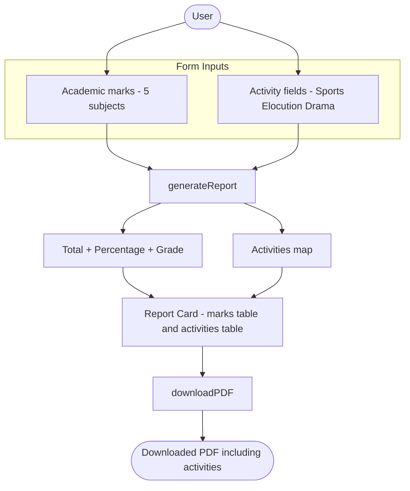

# Student Report Generator using JavaScript

## Overview
This project allows users to:
- Enter student details using a form
- Calculate total marks and percentage
- Generate a formatted student report
- Export the report as a PDF file
- Record **non-academic / co-curricular activities** (Sports, Elocution, Drama), reported separately from the academic marks

> The report now also presents non-academic / co-curricular activities alongside the academic results. For the full walkthrough, see the [Non-Academic Activities guide](docs/non-academic-activities.md).

---

## Data Flow

The end-to-end flow runs from the form inputs through `generateReport()` to the on-screen report card, and finally to the exported PDF via `downloadPDF()`. The non-academic / co-curricular activities follow their own path into the report card and the PDF, in parallel with the academic marks, without affecting the academic score. Source: Readme.md:L223-L339



---

# Project Structure

```text
student-report-generator/
│
├── index.html
├── style.css
├── script.js
└── README.md
```

> **Reference artifact.** The repository also contains `Student Report Generator Javascript Pdf.pdf` — a rendered (generated) copy of this README, kept for reference only. It is not part of the application file structure shown above and becomes stale once the non-academic / co-curricular activities feature is documented here; regenerate it after the feature's documentation and source are finalized. The binary itself is left unchanged in this update.

---

# index.html

```html
<!DOCTYPE html>
<html lang="en">
<head>
    <meta charset="UTF-8">
    <meta name="viewport" content="width=device-width, initial-scale=1.0">
    <title>Student Report Generator</title>

    <link rel="stylesheet" href="style.css">

    <!-- jsPDF Library -->
    <script src="https://cdnjs.cloudflare.com/ajax/libs/jspdf/2.5.1/jspdf.umd.min.js"></script>
</head>
<body>

<div class="container">
    <h1>Student Report Generator</h1>

    <div class="form-section">
        <input type="text" id="studentName" placeholder="Student Name">
        <input type="text" id="rollNumber" placeholder="Roll Number">

        <input type="number" id="maths" placeholder="Maths Marks">
        <input type="number" id="science" placeholder="Science Marks">
        <input type="number" id="english" placeholder="English Marks">
        <input type="number" id="history" placeholder="History Marks">
        <input type="number" id="computer" placeholder="Computer Marks">

        <!-- Non-academic / co-curricular activities (free-text, non-scoring) -->
        <input type="text" id="sports" placeholder="Sports (e.g., Winner - District)">
        <input type="text" id="elocution" placeholder="Elocution (e.g., Participated)">
        <input type="text" id="drama" placeholder="Drama (e.g., Best Actor - School)">

        <button onclick="generateReport()">Generate Report</button>
        <button onclick="downloadPDF()">Download PDF</button>
    </div>

    <div id="reportCard" class="report-card">
        <h2>Student Report</h2>

        <p><strong>Name:</strong> <span id="rName"></span></p>
        <p><strong>Roll Number:</strong> <span id="rRoll"></span></p>

        <table>
            <thead>
                <tr>
                    <th>Subject</th>
                    <th>Marks</th>
                </tr>
            </thead>
            <tbody id="marksTable"></tbody>
        </table>

        <p><strong>Total:</strong> <span id="totalMarks"></span></p>
        <p><strong>Percentage:</strong> <span id="percentage"></span>%</p>
        <p><strong>Grade:</strong> <span id="grade"></span></p>

        <h3>Co-Curricular / Non-Academic Activities</h3>
        <table>
            <thead>
                <tr>
                    <th>Activity</th>
                    <th>Participation / Achievement</th>
                </tr>
            </thead>
            <tbody id="activitiesTable"></tbody>
        </table>
    </div>
</div>

<script src="script.js"></script>

</body>
</html>
```

**New activity inputs (Source: Readme.md:L87-L89).** Three free-text inputs are added to the `form-section`, after the five subject fields and before the buttons. They accept free-text participation / achievement descriptors:

| Input ID | Placeholder | Example value |
|---|---|---|
| `#sports` | `Sports (e.g., Winner - District)` | `Winner - District` |
| `#elocution` | `Elocution (e.g., Participated)` | `Participated` |
| `#drama` | `Drama (e.g., Best Actor - School)` | `Best Actor - School` |

Inside `#reportCard`, a clearly separated **Co-Curricular / Non-Academic Activities** section is rendered after the grade line so the academic summary stays first. Its table body has id `#activitiesTable` and is populated by `generateReport()`.

---

# style.css

```css
body {
    font-family: Arial, sans-serif;
    background: #f4f6f8;
    margin: 0;
    padding: 20px;
}

.container {
    max-width: 800px;
    margin: auto;
    background: white;
    padding: 30px;
    border-radius: 10px;
    box-shadow: 0 0 10px rgba(0,0,0,0.1);
}

h1, h2 {
    text-align: center;
}

.form-section {
    display: grid;
    gap: 10px;
    margin-bottom: 30px;
}

input {
    padding: 10px;
    font-size: 16px;
}

button {
    padding: 12px;
    background: #007bff;
    color: white;
    border: none;
    cursor: pointer;
    border-radius: 5px;
}

button:hover {
    background: #0056b3;
}

.report-card {
    border-top: 2px solid #ddd;
    padding-top: 20px;
}

table {
    width: 100%;
    border-collapse: collapse;
    margin-top: 15px;
}

table, th, td {
    border: 1px solid #ccc;
}

th, td {
    padding: 10px;
    text-align: center;
}
```

**Styling the new activity surface (Source: Readme.md:L149-L211).** No new CSS is required — the activity inputs and the activities table reuse the existing rules. The generic `input` selector (Source: Readme.md:L175-L178) styles the three text inputs, the `.form-section` grid (Source: Readme.md:L169-L173) automatically lays them out alongside the subject fields, and the generic `table`, `table, th, td`, and `th, td` rules (Source: Readme.md:L198-L211) style the activities table exactly like the marks table.

> Optional: the new `<h3>` activities heading is not centered by default. To match `h1, h2`, you may extend the existing centering rule (Source: Readme.md:L165-L167) to `h1, h2, h3`. This is optional and no other CSS changes are needed.

---

# script.js

```javascript
function generateReport() {
    const name = document.getElementById('studentName').value;
    const roll = document.getElementById('rollNumber').value;

    const subjects = {
        Maths: parseInt(document.getElementById('maths').value || 0),
        Science: parseInt(document.getElementById('science').value || 0),
        English: parseInt(document.getElementById('english').value || 0),
        History: parseInt(document.getElementById('history').value || 0),
        Computer: parseInt(document.getElementById('computer').value || 0)
    };

    let total = 0;

    const tableBody = document.getElementById('marksTable');
    tableBody.innerHTML = '';

    for (let subject in subjects) {
        total += subjects[subject];

        const row = `
            <tr>
                <td>${subject}</td>
                <td>${subjects[subject]}</td>
            </tr>
        `;

        tableBody.innerHTML += row;
    }

    const percentage = (total / 500) * 100;

    let grade = 'F';

    if (percentage >= 90) {
        grade = 'A+';
    } else if (percentage >= 80) {
        grade = 'A';
    } else if (percentage >= 70) {
        grade = 'B';
    } else if (percentage >= 60) {
        grade = 'C';
    } else if (percentage >= 50) {
        grade = 'D';
    }

    document.getElementById('rName').innerText = name;
    document.getElementById('rRoll').innerText = roll;
    document.getElementById('totalMarks').innerText = total;
    document.getElementById('percentage').innerText = percentage.toFixed(2);
    document.getElementById('grade').innerText = grade;

    // Collect non-academic / co-curricular activities (free-text, non-scoring).
    // NOTE: these values are NOT added to `total` and do NOT affect `percentage` or `grade`.
    const activities = {
        Sports: document.getElementById('sports').value,
        Elocution: document.getElementById('elocution').value,
        Drama: document.getElementById('drama').value
    };

    const activitiesBody = document.getElementById('activitiesTable');
    activitiesBody.innerHTML = '';

    for (let activity in activities) {
        // Activity values are free-text, so build each row with DOM APIs and
        // assign the text via textContent. The values are therefore rendered
        // as plain text and never parsed as HTML, preventing script/markup
        // injection in the report card.
        const row = document.createElement('tr');

        const activityCell = document.createElement('td');
        activityCell.textContent = activity;

        const valueCell = document.createElement('td');
        valueCell.textContent = activities[activity];

        row.appendChild(activityCell);
        row.appendChild(valueCell);
        activitiesBody.appendChild(row);
    }
}

function downloadPDF() {
    const { jsPDF } = window.jspdf;

    const doc = new jsPDF();

    const name = document.getElementById('rName').innerText;
    const roll = document.getElementById('rRoll').innerText;
    const total = document.getElementById('totalMarks').innerText;
    const percentage = document.getElementById('percentage').innerText;
    const grade = document.getElementById('grade').innerText;

    doc.setFontSize(18);
    doc.text('Student Report Card', 20, 20);

    doc.setFontSize(12);
    doc.text(`Student Name: ${name}`, 20, 40);
    doc.text(`Roll Number: ${roll}`, 20, 50);
    doc.text(`Total Marks: ${total}`, 20, 60);
    doc.text(`Percentage: ${percentage}%`, 20, 70);
    doc.text(`Grade: ${grade}`, 20, 80);

    // Append non-academic / co-curricular activities below the grade line,
    // continuing the existing 10-unit vertical spacing. Informational only;
    // they do not affect the academic score.
    const sports = document.getElementById('sports').value;
    const elocution = document.getElementById('elocution').value;
    const drama = document.getElementById('drama').value;

    doc.text('Non-Academic / Co-Curricular Activities', 20, 95);
    doc.text(`Sports: ${sports}`, 20, 105);
    doc.text(`Elocution: ${elocution}`, 20, 115);
    doc.text(`Drama: ${drama}`, 20, 125);

    doc.save(`${name}_Report.pdf`);
}
```

**How activities are processed (Source: Readme.md:L223-L339).** In `generateReport()`, after the academic marks are summed and the report card is written, the three activity fields are collected into a small `activities` map and rendered into the `#activitiesTable` body (Source: Readme.md:L277-L302). Because the activity values are **free-text**, each row is built with `document.createElement(...)` and its cell text is assigned via `textContent` (Source: Readme.md:L286-L302) — never by interpolating the values into an HTML string. The values are therefore rendered literally and are **never parsed as HTML**, which prevents script/markup injection in the report card. (The academic marks loop, by contrast, renders only numeric subject values and is left unchanged; Source: Readme.md:L240-L251.)

> **Non-scoring behavior (important).** The `activities` map is **never** added to `total`. The academic calculation is unchanged: `percentage = (total / 500) * 100` (Source: Readme.md:L253) and the six-tier grade ladder — **A+ ≥ 90, A ≥ 80, B ≥ 70, C ≥ 60, D ≥ 50, else F** (Source: Readme.md:L255-L267) — remain exactly as before. Activities are reported separately and do **not** affect the percentage or the grade.

In `downloadPDF()`, the same three values are read and appended to the exported PDF **below the grade line** (which sits at y = 80, Source: Readme.md:L324), continuing the existing 10-unit vertical spacing via `doc.text(...)` (provided by jsPDF **2.5.1**, Source: Readme.md:L69, L316-L336). The document is still saved last via `doc.save(...)`, producing `${name}_Report.pdf` (Source: Readme.md:L338).

See the [Non-Academic Activities guide](docs/non-academic-activities.md) for a worked example and troubleshooting notes.

---

# README.md

```md
# Student Report Generator

## Features

- Enter student details
- Calculate percentage automatically
- Generate grade
- Record non-academic / co-curricular activities (Sports, Elocution, Drama)
- Download report as PDF
- Responsive UI

## Technologies Used

- HTML
- CSS
- JavaScript
- jsPDF

## How to Run

1. Download the project
2. Open `index.html` in browser
3. Enter student details
4. Enter non-academic / co-curricular activities (Sports, Elocution, Drama)
5. Click Generate Report
6. Click Download PDF
```

---

# Future Enhancements

> **Update:** This roadmap is now *partially realized* — recording of non-academic / co-curricular activities (Sports, Elocution, Drama) has been added to the student report and the exported PDF. The items below remain planned. See the [Non-Academic Activities guide](docs/non-academic-activities.md).

- Add database support
- Add multiple student report management
- Add charts and analytics
- Add teacher comments
- Add digital signature support
- Export reports to Excel

