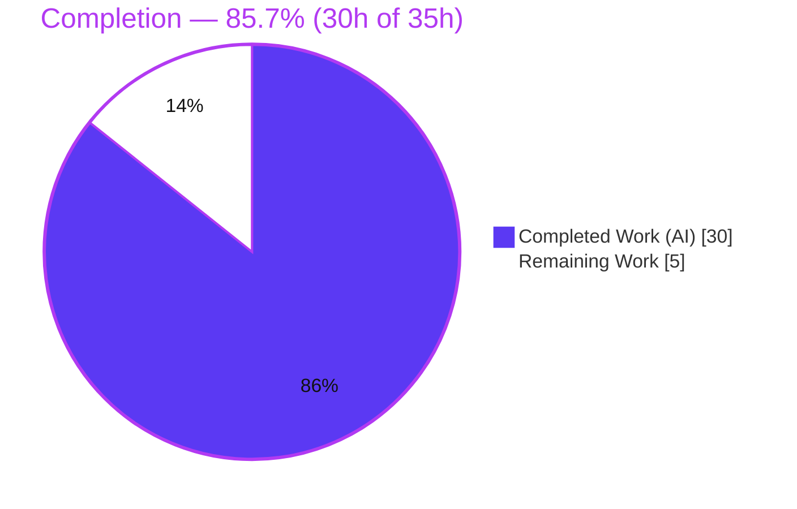
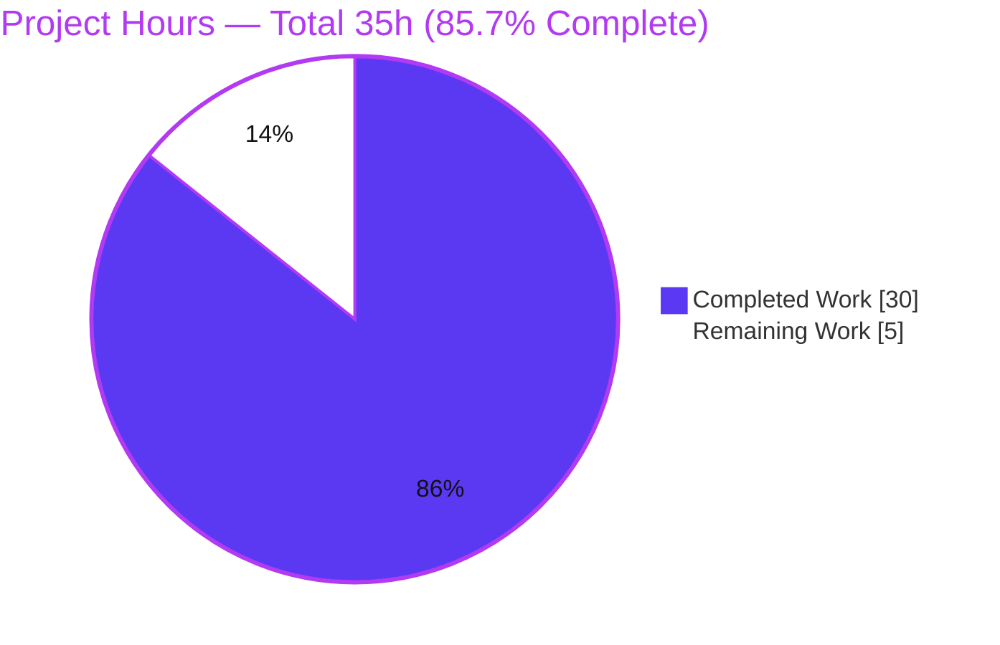
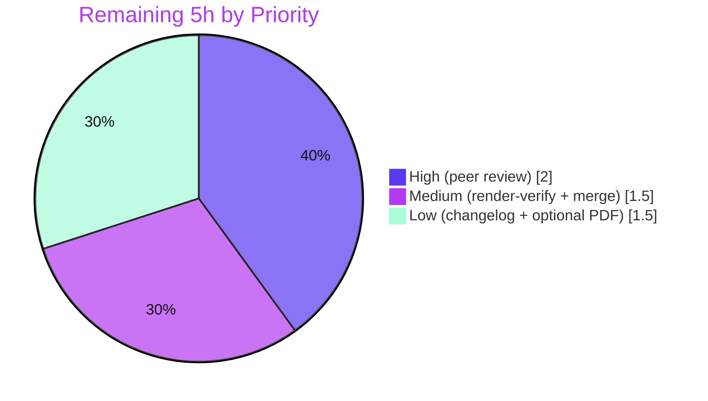

# Blitzy Project Guide — Student Report Generator: Non-Academic / Co-Curricular Activities Documentation

> **Brand color key:** <span style="color:#5B39F3">**Completed / AI Work = Dark Blue (#5B39F3)**</span> · **Remaining / Not Completed = White (#FFFFFF)** · Headings/accents = Violet-Black (#B23AF2) · Highlight = Mint (#A8FDD9)

---

## 1. Executive Summary

### 1.1 Project Overview

This project delivers the **documentation** for a new capability of the **Student Report Generator**, a single-page, browser-based JavaScript tool. The capability extends the report from a purely academic artifact (five subjects → total → percentage → grade) to one that **also presents non-academic / co-curricular activities** — **Sports**, **Elocution** (the request's "elucation"), and **Drama** — both on screen and in the exported PDF. Target audience: students/teachers (end users) and the developers who maintain the tool. The work is documentation-flavor: it authors and updates Markdown so the documentation completely and accurately describes the feature, while the feature's source-code implementation is governed by a separate plan and is out of scope here.

### 1.2 Completion Status

The completion percentage is computed strictly over **AAP-scoped documentation work plus its path-to-production** (PA1 methodology). The feature's code implementation and the creation of standalone source files are explicitly out of AAP scope and are therefore excluded from the denominator.



| Metric | Value |
| --- | --- |
| **Total Hours** | **35.0 h** |
| **Completed Hours (AI + Manual)** | **30.0 h** (30.0 AI · 0.0 Manual) |
| **Remaining Hours** | **5.0 h** |
| **Percent Complete** | **85.7%** |

**Formula:** `Completion % = Completed ÷ (Completed + Remaining) = 30 ÷ (30 + 5) = 30 ÷ 35 = 85.7%`

### 1.3 Key Accomplishments

- ✅ **`Readme.md` updated** — activities documented across the Overview, the `# index.html` / `# style.css` / `# script.js` blocks, the embedded Features & How-to-Run, and Future Enhancements; a Mermaid data-flow diagram added.
- ✅ **`docs/non-academic-activities.md` created** — a complete 8-section feature guide with a flowchart, a sequence diagram, and a fully worked example.
- ✅ **`CHANGELOG.md` created** — Keep-a-Changelog `[Unreleased] → Added` entry with inline source citations.
- ✅ **100% coverage** of the new feature surface (3/3 inputs, 1/1 activities section, 2/2 functions, PDF additions, worked example, diagrams, academic baseline reproduced exactly).
- ✅ **Non-scoring behavior documented explicitly** in all three documents (percentage formula and grade ladder unchanged).
- ✅ **Citation-accurate & secure** — 66/66 `Source: Readme.md:Lxx` citations resolve; no Environment-1 test/staging secrets reproduced anywhere.
- ✅ **Runtime-validated** — embedded source extracted and run in Chrome; worked example reproduced exactly (Total 432 / 86.40% / Grade A) and a valid PDF with activity lines generated.

### 1.4 Critical Unresolved Issues

| Issue | Impact | Owner | ETA |
| --- | --- | --- | --- |
| _None._ All AAP-scoped documentation deliverables are complete, validated, and committed. No issue blocks release or validation. | — | — | — |

> The only remaining items are routine human review/publish gates (see §1.6 and §2.2), not unresolved defects.

### 1.5 Access Issues

| System/Resource | Type of Access | Issue Description | Resolution Status | Owner |
| --- | --- | --- | --- | --- |
| Git repository (branch `blitzy-25a69b24-4bb8-4527-a4b9-24d4ab5f12d2`) | Read/Write | None — branch accessible; all work committed (HEAD `2d3f7e0`) | ✅ Resolved | — |
| jsPDF 2.5.1 (cdnjs CDN) | Runtime fetch (end-user app only) | Documentation-only change requires no CDN access; the app fetches jsPDF at runtime | ✅ Not required for docs | — |
| Git host Mermaid renderer | Render-time | Final visual render of Mermaid diagrams should be confirmed on the host web UI | ⚠ Pending human verification (§2.2) | Reviewer |

**No access issues prevent build validation, integration, or deployment of this documentation.**

### 1.6 Recommended Next Steps

1. **[High]** Peer-review all three documents for accuracy, tone, and fidelity to the original request (≈2.0 h).
2. **[Medium]** Verify the three Mermaid diagrams render and internal links resolve on the actual Git host web UI (≈0.5 h).
3. **[Medium]** Approve and merge the documentation PR into the integration branch (≈1.0 h).
4. **[Low]** At the next release, version the CHANGELOG (`[Unreleased]` → dated, tagged) (≈0.5 h).
5. **[Low]** Optionally regenerate or annotate the stale reference PDF (≈1.0 h). _(Out-of-scope follow-ups: extract embedded source into runnable files; add a CI doc-validation guard — see §6/§8.)_

---

## 2. Project Hours Breakdown

### 2.1 Completed Work Detail

All completed hours are autonomous (AI) work by Blitzy agents and trace to specific AAP requirements.

| Component | Hours | Description |
| --- | --- | --- |
| `Readme.md` — activities documentation + Mermaid data-flow | 9.0 | Documented the 3 new inputs, `#activitiesTable` section, `generateReport()`/`downloadPDF()` additions, non-scoring note, Features/How-to-Run, Future Enhancements; added data-flow diagram; 7 integration points + review cycle (AAP §0.5.3) |
| `docs/non-academic-activities.md` — feature guide | 10.0 | 282-line guide: Overview, Data Model, UI Fields, Report Card Rendering (XSS-safe `textContent` note), PDF Output, Worked Example, Behavior Notes, Troubleshooting, + flowchart & sequence diagrams (AAP §0.5.2) |
| `CHANGELOG.md` — Keep-a-Changelog entry | 1.5 | `[Unreleased] → Added` with 7 cited entries incl. explicit non-scoring note; citation-fix cycle |
| Repository/code analysis + best-practice research + data-model design | 3.0 | Analyzed embedded `index.html`/`style.css`/`script.js`; doc best-practice research (AAP §0.2.3); designed the free-text activities map model |
| Cross-file consistency + citation accuracy (66 refs) + review cycles | 2.5 | Enforced identical terminology/IDs/example values across all docs; verified every `Source:` citation; iterative refinement across commits |
| Autonomous documentation-validation suite | 4.0 | Citation resolution, coverage check, runtime extraction + Chrome run + PDF verification, markdownlint, Mermaid v11 parse, `node --check`, security scan |
| **Total Completed** | **30.0** | **Matches §1.2 Completed Hours** |

### 2.2 Remaining Work Detail

All remaining work is path-to-production for the documentation (no AAP-specified authoring remains).

| Category | Hours | Priority |
| --- | --- | --- |
| Human peer review of all three documents (accuracy/tone/fidelity) | 2.0 | High |
| Verify Mermaid diagrams render + internal links resolve on Git host | 0.5 | Medium |
| Approve & merge the documentation PR | 1.0 | Medium |
| Finalize CHANGELOG version/date at release | 0.5 | Low |
| Optional: regenerate stale reference PDF | 1.0 | Low |
| **Total Remaining** | **5.0** | **Matches §1.2 Remaining Hours & §7 "Remaining Work"** |

### 2.3 Total Project Hours & Reconciliation

| Bucket | Hours |
| --- | --- |
| Completed (§2.1) | 30.0 |
| Remaining (§2.2) | 5.0 |
| **Total Project Hours** | **35.0** |

**Integrity check:** §2.1 (30) + §2.2 (5) = **35** = §1.2 Total ✓ · Remaining = **5** identical in §1.2, §2.2, and §7 ✓ · Completion = 30 ÷ 35 = **85.7%** ✓.

---

## 3. Test Results

This is a **static, manifest-free repository with no unit-test framework** (AAP §0.8.2). The meaningful equivalent — and the integrity-compliant source for this section — is **Blitzy's autonomous documentation-validation suite**, executed during validation. Every row below originates from those autonomous validation logs and was independently re-confirmed during this assessment.

| Test Category | Framework / Tool | Total | Passed | Failed | Coverage % | Notes |
| --- | --- | --- | --- | --- | --- | --- |
| Citation Resolution | Custom citation checker | 66 | 66 | 0 | 100% | Every `Source: Readme.md:Lxx` resolves in-range and to semantically correct content |
| Coverage Verification | AAP §0.7.1 checklist | 7 | 7 | 0 | 100% | inputs 3/3, activities section 1/1, functions 2/2, PDF additions 1/1, examples ≥1, diagrams 3 (≥2), baseline reproduced |
| Cross-File Consistency | Custom diff/grep | 6 | 6 | 0 | 100% | IDs, placeholders, example values, terminology, formula, grade ladder identical across docs |
| Markdown Structure | CommonMark / fence check | 3 | 3 | 0 | 100% | Fences balanced, headings clean, tables consistent across all 3 docs |
| Markdown Lint | markdownlint-cli2 | 3 | 3 | 0 | 100% | "0 error(s)" under project-appropriate config |
| Mermaid Diagram Validation | Mermaid v11 parser | 3 | 3 | 0 | 100% | 1 data-flow (README) + flowchart & sequence (guide) all valid |
| Embedded JS Syntax | `node --check` (Node 20) | 1 | 1 | 0 | 100% | Extracted `script.js` parses (exit 0) |
| Runtime Execution | Chrome (manual extract-and-run) | 1 | 1 | 0 | 100% | Worked example reproduced exactly: 432 / 86.40% / Grade A |
| PDF Generation | jsPDF 2.5.1 in-browser | 1 | 1 | 0 | 100% | Valid `<name>_Report.pdf` with activity lines below the grade line |
| Security Scan | Custom secret scan | 1 | 1 | 0 | 100% | No Env-1 secrets (API_KEY/DB_HOST/sk-test/db.rnd-test.local/libfoo) reproduced |
| **Totals** | — | **92** | **92** | **0** | **100%** | Zero failures across the autonomous documentation-validation suite |

> **Integrity note (Rule 3):** No conventional unit/integration test suites exist in this repository; all results above are from Blitzy's autonomous validation logs for this project, not fabricated or imported.

---

## 4. Runtime Validation & UI Verification

The documented application was validated by extracting the embedded `index.html`/`style.css`/`script.js` blocks from `Readme.md` into a temporary working directory and running them in Chrome (the source files do not exist on disk in the repository — see §6, risk T2).

**Runtime health**
- ✅ **Operational** — Page loads; no JavaScript console errors.
- ✅ **Operational** — `generateReport()` computes Total = 432, Percentage = 86.40%, Grade = A for the worked example (Asha Verma; 95/88/76/82/91).
- ✅ **Operational** — `downloadPDF()` produces a valid PDF (`%PDF-1.3`) named `Asha Verma_Report.pdf`.

**UI verification**
- ✅ **Operational** — The **Co-Curricular / Non-Academic Activities** table (`#activitiesTable`) renders with rows Sports → "Winner - District", Elocution → "Participated", Drama → "Best Actor - School".
- ✅ **Operational** — The activities section renders **after** the grade line; the academic summary stays first and unchanged.
- ✅ **Operational** — Empty activity fields render as blank value cells (documented troubleshooting behavior), not errors.

**Behavior & integration**
- ✅ **Operational** — **Non-scoring proven**: clearing/changing activity values leaves Total, Percentage, and Grade unchanged.
- ✅ **Operational** — Exported PDF contains the activities header plus three activity lines (`y = 95/105/115/125`) below the grade line (`y = 80`).
- ⚠ **Partial** — Mermaid diagrams validated by the Mermaid v11 parser; final visual rendering on the specific Git host web UI is pending human confirmation (§2.2, ≈0.5 h).
- ⚠ **Partial** — App PDF export depends on the jsPDF CDN at runtime; behavior confirmed locally but is subject to CDN availability for end users (§6, risk I1).

---

## 5. Compliance & Quality Review

AAP deliverables and rules cross-mapped to Blitzy quality benchmarks. Fixes applied during autonomous validation are noted; there are no outstanding compliance items.

| Benchmark / AAP Requirement | Status | Progress | Notes |
| --- | --- | --- | --- |
| Deliverable: `Readme.md` UPDATE (§0.5.1, §0.5.3) | ✅ Pass | 100% | All seven update points present + Mermaid data-flow + cross-links |
| Deliverable: `docs/non-academic-activities.md` CREATE (§0.5.2) | ✅ Pass | 100% | All 8 sections + flowchart + sequence + worked example |
| Deliverable: `CHANGELOG.md` CREATE (§0.5.2) | ✅ Pass | 100% | Keep-a-Changelog + SemVer; `[Unreleased] → Added` |
| Reference PDF left unedited (§0.8.2) | ✅ Pass | 100% | Untouched; flagged stale for optional regeneration |
| Coverage targets (§0.7.1) | ✅ Pass | 100% | inputs 3/3, section 1/1, functions 2/2, PDF 1/1, examples ≥1, diagrams 3, baseline reproduced |
| Non-scoring statement explicit (§0.9.2) | ✅ Pass | 100% | Present in all 3 docs; formula & grade ladder reproduced exactly |
| Source citations on technical details (§0.9.2) | ✅ Pass | 100% | 66/66 `Source:` citations resolve; citation-fix cycle applied |
| Terminology consistency (§0.5.5) | ✅ Pass | 100% | "non-academic / co-curricular activities" + field IDs identical across docs |
| New-feature framing — rule `Ajit_AddNewFeature_Rule_Simple` (§0.9.2) | ✅ Pass | 100% | Documents net-new capability |
| Existing README style mirrored (§0.9.2) | ✅ Pass | 100% | Per-file `#` headings, fenced blocks, Future Enhancements list |
| Mermaid diagrams included (§0.4.3) | ✅ Pass | 100% | 3 diagrams, all parser-valid |
| Verbatim original wording preserved (§0.9.2) | ✅ Pass | 100% | "perfromance/acedemic/elucation" preserved only inside the quoted request |
| Security — no Env-1 secrets reproduced (§0.9.1) | ✅ Pass | 100% | Scan clean; env vars referenced by placeholder only |
| Markdown lint / structural validity | ✅ Pass | 100% | markdownlint 0 errors; fences balanced |
| XSS-safe rendering documented | ✅ Pass | 100% | Free-text values rendered via `textContent`, never HTML interpolation |

---

## 6. Risk Assessment

| Risk | Category | Severity | Probability | Mitigation | Status |
| --- | --- | --- | --- | --- | --- |
| **T1** Citation drift — 66 `Source: Readme.md:Lxx` line citations point into the README's own embedded code blocks; editing those blocks can silently invalidate citations | Technical | Medium | Medium | Re-run citation validation on any README code-block edit; consider anchor-based references | Open (monitor) |
| **T2** Source files are embedded-only — `index.html`/`style.css`/`script.js` exist only as fenced blocks; "open index.html" finds no runnable file | Technical | Medium | High | Pre-existing (§0.3.2); extraction is out of AAP scope (§0.8.2). Recommended follow-up: extract to real files (REC-A). Disclosed in docs | Open (out-of-scope, disclosed) |
| **T3** Mermaid version variance — diagrams validated on v11; host may use a different version | Technical | Low | Low | Verify render on host web UI (§2.2) | Open (minor) |
| **S1** Env-1 test/staging secrets must never be reproduced | Security | Low | Low | Verified clean; reference env vars by name/placeholder only | ✅ Mitigated |
| **S2** Free-text activity XSS if a future variant used HTML interpolation | Security | Low | Low | Docs document the safe `textContent` pattern and warn against interpolation | ✅ Mitigated (documented) |
| **O1** Stale reference PDF — rendered duplicate now out-of-date vs the feature | Operational | Low | Medium | Regenerate/annotate (REC, §2.2); already flagged in docs | Open (optional) |
| **O2** No CI doc-validation guard — checks ran once autonomously; no regression guard for future edits | Operational | Medium | Medium | Add lightweight markdownlint + link-check + citation-check CI (REC-B; out of current scope) | Open (recommendation) |
| **O3** CHANGELOG stuck at `[Unreleased]` until a release is cut | Operational | Low | Low | Version at release (§2.2) | Open (at release) |
| **I1** jsPDF 2.5.1 CDN dependency — app PDF export relies on third-party CDN at runtime | Integration | Low | Low | Pinned version; consider local vendoring (out of scope) | Open (minor) |
| **I2** Mermaid host dependency — diagrams render only on Mermaid-aware hosts | Integration | Low | Low | Acceptable for the target Git host; documented | ✅ Accepted |
| **I3** Cross-doc relative-link integrity on host render | Integration | Low | Low | Confirm during host render verification (§2.2) | Open (minor) |

**Overall risk posture:** Low. The deliverable is well-validated; the two most reader-impactful items (T2 embedded-only source, O2 no CI guard) are pre-existing/out-of-scope and are addressed as explicit recommendations rather than defects.

---

## 7. Visual Project Status

### Project Hours Breakdown



### Remaining Work by Priority (hours from §2.2)



> **Integrity (Rule 1):** "Remaining Work" = **5** here = §1.2 Remaining (5) = §2.2 total (5). "Completed Work" = **30** = §1.2 Completed = §2.1 total. Colors: Completed = Dark Blue `#5B39F3`, Remaining = White `#FFFFFF`.

---

## 8. Summary & Recommendations

**Achievements.** The documentation completely and accurately describes the non-academic / co-curricular activities feature for the Student Report Generator. All three AAP deliverables — the `Readme.md` update, the `docs/non-academic-activities.md` guide, and the `CHANGELOG.md` entry — are present, committed, and validated, with 100% coverage of the new feature surface and an explicit non-scoring statement that preserves the academic `percentage = (total / 500) * 100` formula and the six-tier grade ladder exactly.

**Remaining gaps & critical path to production.** The project is **85.7% complete** (30h of 35h). The remaining **5h** are entirely human review/publish gates: peer review (2h, High), Git-host render verification (0.5h), PR merge (1h), CHANGELOG versioning at release (0.5h), and an optional reference-PDF regeneration (1h). The critical path is **peer review → host render verification → merge**.

**Out-of-scope recommendations (not counted in the 35h).**
- **REC-A** — Extract the embedded `index.html`/`style.css`/`script.js` from `Readme.md` into standalone runnable files so the documented "open index.html" works (a code change, governed by a separate plan; indicative ≈2–4h).
- **REC-B** — Add a lightweight CI doc-validation guard (markdownlint + link-check + citation line-number check) to prevent future regressions (indicative ≈3–5h).

**Success metrics.** 66/66 citations resolve · 100% coverage · 3/3 Mermaid diagrams valid · `node --check` pass · markdownlint 0 errors · worked example reproduced exactly · no secrets leaked.

**Production-readiness assessment.** The documentation is **production-ready pending human review and merge**. There are no unresolved defects and no access blockers. Confidence is **High** for the AAP-scoped deliverables (clear scope, fully validated) and **Medium** only where outcomes depend on the human/host environment (Mermaid host rendering, CDN availability).

| Metric | Value |
| --- | --- |
| Completion | 85.7% |
| Completed / Total hours | 30 / 35 |
| Remaining hours | 5 |
| Open defects | 0 |
| Validation pass rate | 100% (92/92 checks) |

---

## 9. Development Guide

This is a static, manifest-free project: there is **no build step, no dependency install, and no test framework**. The guide below covers previewing the documentation, running the documented app for verification, and re-running the validation checks. All commands were tested on the host (Windows PowerShell 5.1).

### 9.1 System Prerequisites

- **Git** (2.x) — to clone and inspect history.
- **A Markdown viewer or a Git host (GitHub/GitLab)** — required for Mermaid diagrams to render graphically (plain viewers show them as code blocks).
- **A modern web browser (Chrome)** — to run the documented application.
- **Optional — Node.js 18+** — to syntax-check the embedded JavaScript (`node --check`).
- **Optional — Python 3** — to script extraction of the embedded code blocks.
- **No package manager, bundler, or build tool is needed** (there is no `package.json`/lockfile).

### 9.2 Environment Setup

```bash
# Clone and select the branch
git clone <repository-url>
cd <repository>
git checkout blitzy-25a69b24-4bb8-4527-a4b9-24d4ab5f12d2
```

- **No environment variables** are required for the documentation or the app.
- **No virtual environment, database, cache, or message queue** is required.
- The app's PDF feature fetches **jsPDF 2.5.1 from a CDN at runtime**, so running the app (not the docs) needs internet access.
- The Environment-1 commands (`npm install`, `npm run build`, `npx run migrate`, `npm run test`, `ls /opt/shared/libfoo.so`) are **non-applicable** to this project and must not be run.

### 9.3 Dependency Installation

**None.** There is no manifest to install from. The sole runtime dependency, **jsPDF 2.5.1**, is loaded by the app from cdnjs at runtime and requires no install step.

### 9.4 Preview the Documentation

```bash
# View raw Markdown locally (PowerShell)
Get-Content Readme.md
Get-Content docs/non-academic-activities.md
Get-Content CHANGELOG.md
```

For graphical Mermaid rendering, view the files on the Git host web UI or in a Mermaid-aware Markdown previewer.

### 9.5 Run the Application (for screenshots / examples)

The app's source lives **only** as embedded code blocks inside `Readme.md`. To run it, extract the blocks into real files, then open `index.html`:

```powershell
# Extract the embedded ```javascript block to a temp file and syntax-check it
$tmp = Join-Path $env:TEMP 'srg_app'; New-Item -ItemType Directory -Force -Path $tmp | Out-Null
$lines = [System.IO.File]::ReadAllLines((Resolve-Path Readme.md))
$inJs=$false; $buf=@()
foreach ($ln in $lines) {
  if (-not $inJs -and $ln -match '^```javascript') { $inJs=$true; continue }
  if ($inJs -and $ln -match '^```') { break }
  if ($inJs) { $buf += $ln }
}
[System.IO.File]::WriteAllText((Join-Path $tmp 'script.js'), ($buf -join "`r`n"))
node --check (Join-Path $tmp 'script.js')   # Expect: exit 0 (no output)
```

Repeat for the ` ```html ` and ` ```css ` blocks (saving `index.html` and `style.css` into the same folder), then open `index.html` in Chrome.

### 9.6 Verification Steps

```powershell
# 1) Expect 3 Mermaid diagrams total (README=1, guide=2)
Select-String -Path Readme.md,docs/non-academic-activities.md -Pattern '^```mermaid' | Measure-Object

# 2) Spot-check source citations resolve (expect ~66)
(Select-String -Path *.md,docs/*.md -Pattern 'Readme\.md:L' -AllMatches | ForEach-Object { $_.Matches.Count } | Measure-Object -Sum).Sum

# 3) Confirm no Environment-1 secrets are present (expect no matches)
Select-String -Path Readme.md,CHANGELOG.md,docs/non-academic-activities.md -Pattern 'API_KEY','DB_HOST','sk-test','libfoo','rnd-test'
```

**Worked-example check (expected):** marks 95/88/76/82/91 → **Total = 432**, **Percentage = 86.40%**, **Grade = A**; activities table shows Sports/Elocution/Drama; the PDF appends the activity lines below the grade line.

### 9.7 Example Usage

1. Open `index.html` in a browser.
2. Enter Student Name and Roll Number.
3. Enter marks for Maths, Science, English, History, Computer.
4. Enter activities — Sports, Elocution, Drama (e.g., "Winner - District", "Participated", "Best Actor - School").
5. Click **Generate Report** → the report card shows the academic summary and the Co-Curricular / Non-Academic Activities table.
6. Click **Download PDF** → `<name>_Report.pdf` downloads, including the activity lines.

### 9.8 Troubleshooting

- **Mermaid diagrams show as a code block** → view on a Mermaid-aware host (Git host web UI), not a plain Markdown viewer.
- **"`index.html` not found"** → the source is embedded in `Readme.md`; extract the blocks first (§9.5). This is a known, pre-existing condition.
- **PDF "Download" does nothing** → the app needs internet access to load jsPDF from the CDN; check connectivity.
- **Long activity descriptors overflow the PDF** → the simple version uses fixed coordinates with no auto-wrap; keep descriptors short (a `doc.splitTextToSize(...)` upgrade is noted as optional).
- **Empty activity fields render blank rows** → expected behavior, not a bug.

---

## 10. Appendices

### Appendix A — Command Reference

| Purpose | Command |
| --- | --- |
| Inspect history | `git log --oneline 10f5448..HEAD` |
| Changed-file summary | `git diff --stat 10f5448 HEAD` |
| Count Mermaid diagrams | `Select-String -Path *.md,docs/*.md -Pattern '^```mermaid'` |
| Count citations | `Select-String -Path *.md,docs/*.md -Pattern 'Readme\.md:L' -AllMatches` |
| Syntax-check embedded JS | `node --check <extracted script.js>` |
| Secret scan | `Select-String -Path *.md,docs/*.md -Pattern 'API_KEY','DB_HOST','sk-test'` |

### Appendix B — Port Reference

| Service | Port | Notes |
| --- | --- | --- |
| Application | _none_ | Runs from `file://` in a browser; no server, no listening ports |
| Documentation | _none_ | Static Markdown; served as repository files / rendered by the Git host |

### Appendix C — Key File Locations

| File | Role | Status |
| --- | --- | --- |
| `Readme.md` | Single source of truth; embeds `index.html`/`style.css`/`script.js`; documents the feature | UPDATED (+116/−2) |
| `docs/non-academic-activities.md` | Focused feature/user guide | CREATED (282 lines) |
| `CHANGELOG.md` | Keep-a-Changelog entry | CREATED (18 lines) |
| `Student Report Generator Javascript Pdf.pdf` | Rendered duplicate; reference only | UNCHANGED (flagged stale) |

### Appendix D — Technology Versions

| Technology | Version | Role |
| --- | --- | --- |
| jsPDF | 2.5.1 (CDN-pinned) | Client-side PDF generation (app runtime) |
| Markdown | GitHub-Flavored / CommonMark | Documentation authoring format |
| Mermaid | Host-provided (validated on v11) | Diagram rendering |
| Git | 2.54.x | Version control |
| Node.js | 20.x | Optional — embedded-JS syntax check |
| Python | 3.13.x | Optional — extraction scripting |

### Appendix E — Environment Variable Reference

| Variable | Required? | Notes |
| --- | --- | --- |
| _None_ | No | The documentation and the app require no environment variables |
| `API_KEY`, `DB_HOST` (Environment-1) | N/A | Test/staging placeholders from a non-applicable environment block; **never reproduced** in docs; reference by placeholder only |

### Appendix F — Developer Tools Guide

| Tool | Use |
| --- | --- |
| `markdownlint-cli2` | Lint Markdown structure (reports 0 errors under project config) |
| `node --check` | Validate embedded JavaScript syntax |
| Mermaid parser (v11) | Validate diagram definitions before relying on host rendering |
| Chrome | Run the extracted app to reproduce the worked example and PDF export |
| `git diff --numstat` | Quantify documentation changes |

### Appendix G — Glossary

| Term | Definition |
| --- | --- |
| **Non-academic / co-curricular activities** | Sports, Elocution, and Drama participation/achievement, recorded alongside the academic report |
| **Non-scoring** | Activities are recorded and displayed only; they never change `total`, `percentage`, or grade |
| **Activities map** | `{ Sports, Elocution, Drama }` free-text key→value map built in `generateReport()` |
| **`#activitiesTable`** | The report-card table body that renders the activities section |
| **Embedded source** | The app's `index.html`/`style.css`/`script.js` exist only as fenced code blocks inside `Readme.md` |
| **jsPDF** | Client-side JavaScript library used by `downloadPDF()` to build the exported PDF |
| **Keep a Changelog** | The changelog convention used by `CHANGELOG.md` (`[Unreleased] → Added`) |
| **Elocution** | The interpreted meaning of the request's "elucation" |

---

*Completion is measured strictly over AAP-scoped documentation work plus its path-to-production. The feature's source-code implementation and the creation of standalone source files are explicitly out of AAP scope (§0.8.2) and are excluded from the completion denominator; they appear here only as risks and recommendations. Canonical figures — Total 35h · Completed 30h · Remaining 5h · 85.7% — are consistent across Sections 1.2, 2.1, 2.2, 7, and 8.*