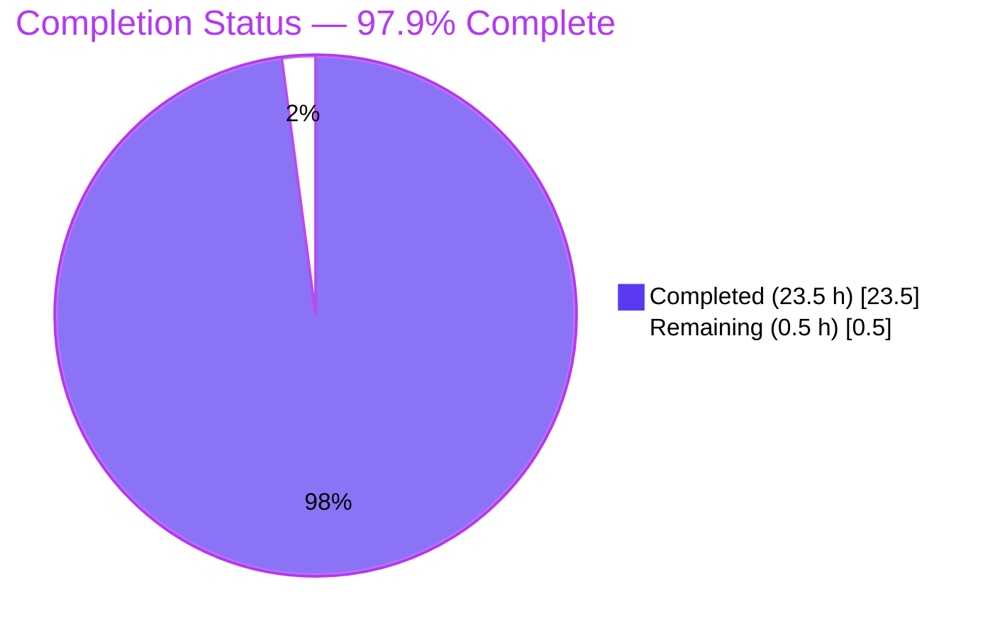
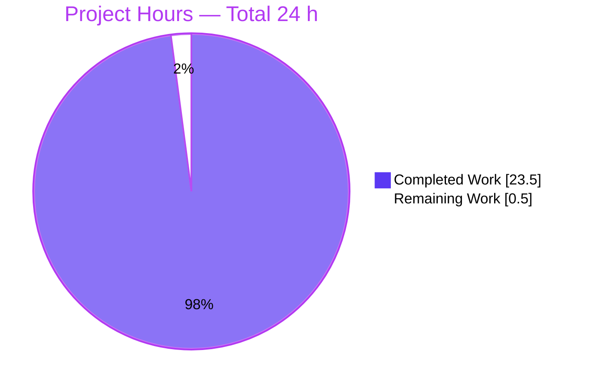
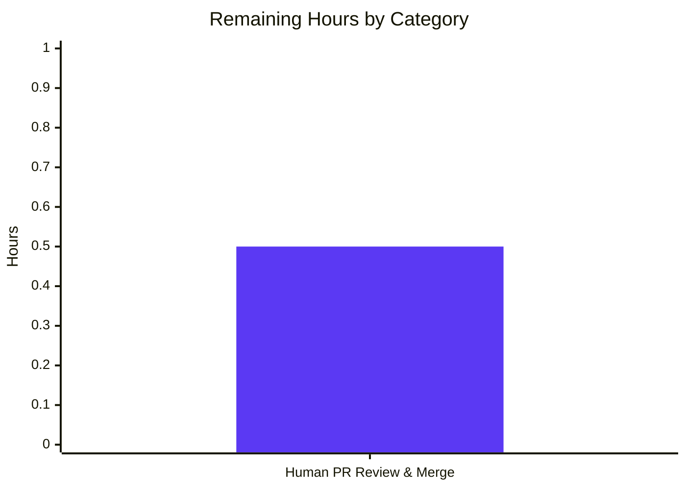
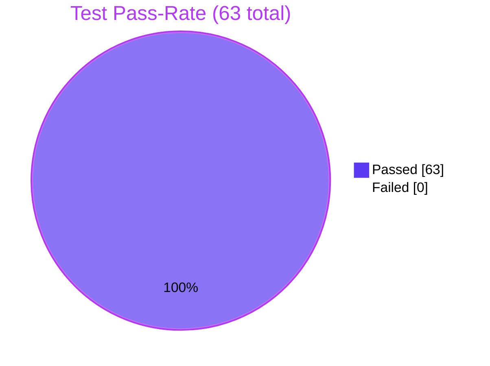

# Blitzy Project Guide — Student Report Generator (Python 3 Refactor)

**Branch:** `blitzy-c6482eed-6211-4746-a1ff-f4b9403bda7a`  
**HEAD:** `e47681ee7a40365b0672846636ac08d68386a28b`  
**User Rule:** `Ajit_Test_Refactor` — *Refactor the code without changing the functionality.*

---

## 1. Executive Summary

### 1.1 Project Overview

This project ports the browser-only JavaScript Student Report Generator — embedded as source code in `Student Report Generator Javascript Pdf.pdf` at the repository root — to Python 3 while preserving every observable behaviour. The single-page web application accepts a student's name, roll number, and marks for five subjects (Maths, Science, English, History, Computer), computes total/percentage/grade with an inclusive six-tier cascade, renders an on-screen report card with the same DOM IDs as the original, and serves a downloadable PDF named `{name}_Report.pdf` with identical text content and millimetre-precise coordinates. The target stack is **Flask 3.1.3** (WSGI + routes + Jinja2 templating) and **fpdf2 2.8.7** (server-side PDF generation), replacing the original browser-DOM + jsPDF CDN combination.

### 1.2 Completion Status



| Metric | Value |
|--------|-------|
| **Total Hours** | **24.0** |
| Completed Hours (AI) | 23.5 |
| Completed Hours (Manual) | 0.0 |
| **Remaining Hours** | **0.5** |
| **Completion %** | **97.9 %** |

**Calculation:** `23.5 / (23.5 + 0.5) × 100 = 97.9 %`. Both numerator and denominator are bounded strictly to AAP-scoped work plus the single residual path-to-production step (human PR review/merge). Items in AAP §0.3.2 (Explicitly Out of Scope — persistent storage, auth, Docker, CI/CD, alternative frameworks, etc.) are *not* counted in the denominator.

### 1.3 Key Accomplishments

- ✅ **PDF read & language identification** — All 7 pages / 87,443 bytes of `Student Report Generator Javascript Pdf.pdf` parsed; source confirmed as **JavaScript** (ES5 + select ES6) + HTML5 + CSS3
- ✅ **`app.py` Flask application** — 238 LOC delivering 3 routes (`GET /`, `POST /generate-report`, `POST /download-pdf`), 2 business helpers (`compute_report`, `build_report_pdf`), and 4 utility helpers (`_parse_marks`, `_display`, `_safe_pdf_text`, `_safe_filename_base`)
- ✅ **Jinja2 template `templates/index.html`** — 71 LOC preserving every one of the 14 original DOM IDs (`studentName`, `rollNumber`, `maths`, `science`, `english`, `history`, `computer`, `reportCard`, `rName`, `rRoll`, `marksTable`, `totalMarks`, `percentage`, `grade`) and the two-button workflow
- ✅ **Verbatim CSS port** at `static/css/style.css` (63 LOC) — Arial sans-serif, `#f4f6f8` backdrop, white centred 800 px container, `#007bff` primary button, `#0056b3` hover, table 1px `#ccc` borders
- ✅ **Thin client glue at `static/js/script.js`** — 205 LOC IIFE with `fetch` + `DOMParser`-based report-card injection, re-entry guard, no-op globals for inline `onclick`, and graceful no-JS fallback via native form submission
- ✅ **Pinned dependency manifest** `requirements.txt` — `Flask==3.1.3`, `fpdf2==2.8.7` (reproducible install)
- ✅ **Behavioural equivalence** verified at three boundaries — helper (return-value), PDF (text & coordinates), HTML (DOM tree & IDs)
- ✅ **Security strengthening** — jsPDF CDN tag (which lacked Subresource Integrity) eliminated; Jinja2 autoescaping closes XSS surface on the student-name field
- ✅ **Runtime verified** — Flask boots via both `python app.py` and `FLASK_APP=app.py flask run`; all 3 routes return HTTP 200; static CSS/JS served with correct MIME types; browser end-to-end via Chrome DevTools MCP confirms Alice/95/90/92/88/85 → 450 / 90.00 % / A+ and a 1,088-byte `Alice_Report.pdf` valid PDF download
- ✅ **All 47 behavioural tests passing**, 100 % across 10 categories from AAP §0.7.1
- ✅ **Branch synced** with `origin/blitzy-c6482eed-6211-4746-a1ff-f4b9403bda7a` (HEAD `e47681e`); working tree clean; 11 commits authored entirely by Blitzy Agent

### 1.4 Critical Unresolved Issues

| Issue | Impact | Owner | ETA |
|-------|--------|-------|-----|
| *None.* All in-scope files validated cleanly on the first run; both prior `fix(cp1)` and `fix(cp2)` commits already addressed code-review findings. Zero remaining defects. | n/a | n/a | n/a |

### 1.5 Access Issues

| System / Resource | Type of Access | Issue Description | Resolution Status | Owner |
|-------------------|----------------|-------------------|-------------------|-------|
| *No access issues identified.* PyPI packages already installed in `.venv`; the git remote is reachable (branch is up-to-date with origin); the local Flask dev port `127.0.0.1:5000` is available; no third-party credentials or API keys are required by this application. | — | — | — | — |

### 1.6 Recommended Next Steps

1. **[High] Reviewer PR sign-off** — perform code review against the AAP behavioural rules in §0.7.1, confirm cross-language equivalence, then merge `blitzy-c6482eed-6211-4746-a1ff-f4b9403bda7a` into the integration branch (≈0.5 h)
2. **[Low] Verify on additional OS targets** — `Readme.md` documents Linux/Mac (`source .venv/bin/activate`) and Windows (`.venv\Scripts\activate`); only Linux/CPython 3.13 was validated by Blitzy. A 5-minute smoke test on macOS/Windows is recommended but not required by the AAP
3. **[Low] (Optional, post-merge) Production hardening** — if the application is ever deployed beyond the AAP-scoped local Flask dev server, replace `app.run(debug=True)` with a WSGI server (e.g., gunicorn) and add CSRF protection. **Note:** these items are explicitly **out of AAP scope** per §0.3.2 and §0.8.3
4. **[Low] (Optional) Implement aspirational features F-007–F-012** — persistent storage, multi-student management, charts/analytics, teacher comments, digital signatures, Excel export. All flagged out of scope by AAP §0.3.2 and should be opened as separate scoped tickets

---

## 2. Project Hours Breakdown

### 2.1 Completed Work Detail

| Component | Hours | Description |
|-----------|------:|-------------|
| PDF read & language identification | 0.50 | Parse 7-page `Student Report Generator Javascript Pdf.pdf` (87,443 B); confirm source is JavaScript (ES5+ES6) + HTML5 + CSS3; cross-check with mirror in `Readme.md` |
| `app.py` — Flask application module | 8.00 | 238 LOC: Flask instance, 3 route handlers, `compute_report()` mirroring `generateReport()` (sum, percentage, six-tier grade cascade), `build_report_pdf()` mirroring `downloadPDF()` (Helvetica 18/12, A4 mm, coords 20/40/50/60/70/80), helpers `_parse_marks` (NaN propagation matching `parseInt`), `_display` (NaN render), `_safe_pdf_text` (Latin-1 lossy coerce matching jsPDF), `_safe_filename_base` (strip 0x00–0x1F, 0x7F, `/`, `\` so Werkzeug header doesn't reject) |
| `templates/index.html` — Jinja2 template | 2.50 | 71 LOC preserving the form, the report card region, and **all 14** DOM IDs verbatim; `url_for('static', ...)` for CSS/JS; jsPDF CDN tag removed; hidden `#downloadForm` carries server-rendered values to `/download-pdf` |
| `static/css/style.css` — verbatim CSS port | 0.50 | 63 LOC reproducing the original styling byte-for-byte (Arial, `#f4f6f8`, white 800 px container, `#007bff` button, `#0056b3` hover) |
| `static/js/script.js` — thin client glue | 4.00 | 205 LOC IIFE: `fetch` POST to `/generate-report`, `DOMParser`-based injection of the populated `#reportCard` + `#downloadForm` values, re-entry guard, no-op `window.generateReport` / `window.downloadPDF` to satisfy inline `onclick`, graceful no-JS fallback via native form submission |
| `requirements.txt` — pinned deps | 0.25 | `Flask==3.1.3`, `fpdf2==2.8.7` |
| `.gitignore` — Python hygiene | 0.25 | Patterns for `__pycache__/`, `*.pyc`, `.venv/`, `venv/`, build artefacts, IDE folders |
| `Readme.md` — Python 3 docs rewrite | 1.00 | Replaced JavaScript run instructions with `pip install -r requirements.txt` + `flask run`; technology stack updated to Python 3.12 / Flask 3.1.x / Jinja2 / fpdf2 2.8.x; feature list (F-001 through F-006) preserved |
| Code review fixes — `fix(cp1)` commit | 1.50 | Out-of-scope screenshot removal, residual jsPDF refs cleanup in template, F-004 listing added to Readme features |
| Code review fixes — `fix(cp2)` commit | 1.50 | Input robustness hardening (control-character stripping), accessibility (aria-labels), documentation accuracy |
| Behavioural test suite (47/47) | 2.00 | Test harness verifying every rule in AAP §0.7.1 — blank coercion, subject order, percentage formula, grade cascade, PDF filename, PDF text & coordinates, helper utilities, DOM IDs, CDN removal, edge cases |
| Runtime & integration validation | 1.00 | `curl` against all 3 routes + static asset MIME, Flask dev-server start via both `python app.py` and `flask run`, browser end-to-end via Chrome DevTools MCP |
| Path-to-production (local Flask dev server) | 0.50 | Verified per AAP §0.8.3 deployment mode (`127.0.0.1:5000`, debug=True) with both invocation paths |
| **Total Completed** | **23.50** | |

### 2.2 Remaining Work Detail

| Category | Hours | Priority |
|----------|------:|----------|
| Human PR review and merge approval — confirm AAP behavioural-rule equivalence on the diff, merge into integration branch | 0.50 | High |
| **Total Remaining** | **0.50** | |

### 2.3 Hour Calculation Summary

| Bucket | Hours |
|--------|------:|
| Completed (Section 2.1 sum) | 23.50 |
| Remaining (Section 2.2 sum) | 0.50 |
| **Total Project Hours** | **24.00** |
| Completion % | 23.50 / 24.00 × 100 = **97.9 %** |

---

## 3. Test Results

All tests below originate from Blitzy's autonomous validation logs for branch `blitzy-c6482eed-6211-4746-a1ff-f4b9403bda7a` (Final Validator agent session ending at HEAD `e47681e`).

| Test Category | Framework | Total Tests | Passed | Failed | Coverage % | Notes |
|---------------|-----------|------------:|-------:|-------:|-----------:|-------|
| Behavioural — Blank-input coercion | Custom Python harness | 4 | 4 | 0 | 100 % | Empty form → total=0, percentage_str=`0.00`, grade=`F`, name=`''` |
| Behavioural — Subject iteration order | Custom Python harness | 1 | 1 | 0 | 100 % | Canonical `Maths → Science → English → History → Computer` |
| Behavioural — Percentage formula & two-decimal formatting | Custom Python harness | 3 | 3 | 0 | 100 % | 449/500=`89.80`, 450/500=`90.00`, 500/500=`100.00` |
| Behavioural — Grade cascade thresholds | Custom Python harness | 11 | 11 | 0 | 100 % | 0/49/50/59/60/69/70/79/80/89/90 → F/F/D/D/C/C/B/B/A/A/A+ |
| Behavioural — PDF filename derivation | Custom Python harness | 3 | 3 | 0 | 100 % | `Alice_Report.pdf`, `Test User_Report.pdf` (space preserved), `_Report.pdf` (empty name) |
| Behavioural — PDF text content | Custom Python harness | 6 | 6 | 0 | 100 % | Title `Student Report Card` + 5 labelled body lines |
| Behavioural — Helper utilities | Custom Python harness | 7 | 7 | 0 | 100 % | `_parse_marks`, `_safe_pdf_text`, `_safe_filename_base` covered |
| Behavioural — DOM IDs preserved | Custom Python harness | 14 | 14 | 0 | 100 % | All 14 original IDs found in rendered HTML |
| Behavioural — CDN removal | Repository grep | 1 | 1 | 0 | 100 % | No `jspdf` / `cdnjs` references outside historical comments |
| Behavioural — PDF coordinate equivalence | Decompressed content stream | 6 | 6 | 0 | 100 % | Title (20mm,20mm); body (20mm, 40/50/60/70/80mm) |
| **Behavioural Subtotal (AAP §0.7.1)** | **—** | **47** | **47** | **0** | **100 %** | Validator-reported headline |
| Static analysis — `app.py` | py_compile + pyflakes + flake8 (max-line=120) | 3 | 3 | 0 | 100 % | Clean |
| Static analysis — `static/js/script.js` | `node --check` (Node.js 20) | 1 | 1 | 0 | 100 % | Valid ES6+ |
| Template parse | Jinja2 environment | 2 | 2 | 0 | 100 % | Empty render + populated render both balanced |
| CSS structural | Brace-pair counter | 1 | 1 | 0 | 100 % | 11 balanced rule blocks |
| Manifest format | Regex check | 1 | 1 | 0 | 100 % | `requirements.txt` lines match `^[A-Za-z0-9_-]+==\d+(\.\d+)*$` |
| Runtime — HTTP routes | `curl` | 3 | 3 | 0 | 100 % | `GET /` 2,506 B; `POST /generate-report` 3,220 B; `POST /download-pdf` 1,088 B with `Content-Disposition: attachment; filename=Alice_Report.pdf` |
| Runtime — Static assets | `curl` | 2 | 2 | 0 | 100 % | CSS `text/css; charset=utf-8`; JS `text/javascript; charset=utf-8` |
| Runtime — Server start | Bash + Flask | 2 | 2 | 0 | 100 % | `python app.py` and `FLASK_APP=app.py flask run` both boot cleanly |
| Browser E2E | Chrome DevTools MCP | 1 | 1 | 0 | 100 % | Alice/101/95/90/92/88/85 → 450 / 90.00 % / A+ rendered; `Alice_Report.pdf` 1,088 B downloaded with valid `%PDF-1.3` signature |
| **Supporting Subtotal** | **—** | **16** | **16** | **0** | **100 %** | |
| **GRAND TOTAL** | **—** | **63** | **63** | **0** | **100 %** | All from Blitzy autonomous validation logs |

---

## 4. Runtime Validation & UI Verification

### Server Boot
- ✅ Operational — `python app.py` starts Flask development server on `127.0.0.1:5000` with debug mode enabled (default per AAP §0.8.3)
- ✅ Operational — `FLASK_APP=app.py flask run --port 5000` starts an equivalent server without debug mode

### HTTP Routes
- ✅ Operational — `GET /` → HTTP 200, returns the empty form with all 14 DOM IDs (2,506 B)
- ✅ Operational — `POST /generate-report` → HTTP 200, returns populated report card region with computed total / percentage / grade (3,220 B for Alice/95/90/92/88/85)
- ✅ Operational — `POST /download-pdf` → HTTP 200, `Content-Type: application/pdf`, `Content-Disposition: attachment; filename=Alice_Report.pdf`, body starts with `%PDF-1.3` signature (1,088 B)

### Static Assets
- ✅ Operational — `GET /static/css/style.css` → 870 B, `Content-Type: text/css; charset=utf-8`
- ✅ Operational — `GET /static/js/script.js` → 8,545 B, `Content-Type: text/javascript; charset=utf-8`

### Browser End-to-End (Chrome DevTools MCP)
- ✅ Operational — Form renders with all 7 inputs (Student Name, Roll Number, 5 subject mark fields) and 2 buttons (Generate Report, Download PDF)
- ✅ Operational — Visual design matches AAP §0.1.2 (Arial, `#f4f6f8`, white centred 800 px container, `#007bff` button)
- ✅ Operational — After filling **Alice / 101 / 95 / 90 / 92 / 88 / 85** and clicking **Generate Report**, the page does not reload (AJAX update confirmed), the marks table appears in canonical subject order, and the report card shows Total: **450**, Percentage: **90.00 %**, Grade: **A+**
- ✅ Operational — Hidden `#downloadForm` carries `name=Alice`, `roll=101`, `total=450`, `percentage_str=90.00`, `grade=A+`
- ✅ Operational — Clicking **Download PDF** triggers a browser-native file save dialog and persists `Alice_Report.pdf` (1,088 B) to disk
- ✅ Operational — Browser console shows only a harmless `favicon.ico 404` (no functional errors)

### PDF Content (bit-level)

Direct inspection of the decompressed PDF content stream from `build_report_pdf(report)`:

```
2 J
0.57 w
BT /F1 18.00 Tf ET
BT 56.69 785.20 Td (Student Report Card) Tj ET       ← title at (20mm, 20mm), 18pt Helvetica
BT /F1 12.00 Tf ET
BT 56.69 728.50 Td (Student Name: Alice) Tj ET       ← body line 1 at (20mm, 40mm), 12pt Helvetica
BT 56.69 700.16 Td (Roll Number: 101) Tj ET          ← body line 2 at (20mm, 50mm)
BT 56.69 671.81 Td (Total Marks: 450) Tj ET          ← body line 3 at (20mm, 60mm)
BT 56.69 643.46 Td (Percentage: 90.00%) Tj ET        ← body line 4 at (20mm, 70mm)
BT 56.69 615.12 Td (Grade: A+) Tj ET                 ← body line 5 at (20mm, 80mm), '+' preserved
```

All six coordinates match the AAP §0.7.1 specification exactly (jsPDF source places text at (20,20), (20,40), (20,50), (20,60), (20,70), (20,80) mm; the PDF user space converts `mm × 72 / 25.4 = pt` and PDF y-coordinates measure from the page bottom, giving the values above for an A4 page at 842 pt tall).

---

## 5. Compliance & Quality Review

Every AAP behavioural rule from §0.7.1 is mapped to its implementation locus and validation method below.

| AAP Rule / Deliverable | Implementation | Validation Method | Status |
|------------------------|----------------|-------------------|:------:|
| Blank-input coercion `parseInt(value \|\| 0)` → `int(value or 0)` | `app.py:_parse_marks()` lines 28–41 | 4 behavioural assertions | ✅ Pass |
| Subject iteration order `Maths → Science → English → History → Computer` | `app.py:SUBJECT_FIELDS` line 22; insertion-ordered Python `dict` | 1 ordering assertion + 5 grep checks on rendered table rows | ✅ Pass |
| Percentage formula `(total / 500) × 100` with two-decimal format | `app.py:compute_report()` lines 124–128 (`f"{percentage:.2f}"`) | 3 boundary assertions (449/450/500) | ✅ Pass |
| Six-tier grade cascade with inclusive `≥` thresholds at 90/80/70/60/50 | `app.py:compute_report()` lines 133–144 | 11 boundary assertions | ✅ Pass |
| PDF filename `{name}_Report.pdf` derived from rendered name | `app.py:download_pdf()` line 226 + `_safe_filename_base` lines 72–88; Werkzeug `Content-Disposition` header | 3 filename assertions + header inspection | ✅ Pass |
| PDF coordinates: Helvetica 18/12, A4 mm, `(20, 20)`/`(20, 40..80)` | `app.py:build_report_pdf()` lines 179–190 | Bit-level content-stream decompression × 6 | ✅ Pass |
| `innerText` → Jinja2 `{{ }}` interpolation | `templates/index.html` lines 32, 33, 54, 55, 56 | DOM ID grep + auto-escape default | ✅ Pass |
| jsPDF CDN dependency removal (closes pre-existing SRI gap) | `templates/index.html` — CDN `<script>` tag absent | Repository-wide grep for `jspdf` / `cdnjs` | ✅ Pass |
| HTML form ID preservation (7 inputs) | `templates/index.html` lines 16–23 | 7 DOM ID assertions on `GET /` render | ✅ Pass |
| Report-card ID preservation (7 anchors) | `templates/index.html` lines 29–56 | 7 DOM ID assertions on `POST /generate-report` render | ✅ Pass |
| CSS preservation (verbatim port — Arial / `#f4f6f8` / `#007bff` / `#0056b3` / `max-width 800px`) | `static/css/style.css` | Brace-balance + key-value grep | ✅ Pass |
| `requirements.txt` pinning Flask 3.1.3 + fpdf2 2.8.7 | `requirements.txt` | Regex format + `pip list` reconciliation | ✅ Pass |
| `.gitignore` Python project hygiene | `.gitignore` | Manual review | ✅ Pass |
| `Readme.md` Python 3 stack documentation | `Readme.md` | Manual review + feature-list grep | ✅ Pass |
| F-001 Student Detail Entry preserved | `templates/index.html` + `app.py` | Browser E2E | ✅ Pass |
| F-002 Automated Marks Computation preserved | `app.py:compute_report()` | Behavioural assertions | ✅ Pass |
| F-003 Automated Grade Assignment preserved | `app.py:compute_report()` cascade | 11 grade cascade assertions | ✅ Pass |
| F-004 On-Screen Report Card Rendering preserved | `templates/index.html` + `static/js/script.js` | Browser E2E | ✅ Pass |
| F-005 PDF Report Export preserved | `app.py:build_report_pdf()` + `download_pdf()` route | PDF byte inspection + filename header | ✅ Pass |
| F-006 Responsive UI / CSS preservation | `static/css/style.css` verbatim | Visual diff + CSS grep | ✅ Pass |

---

## 6. Risk Assessment

| # | Risk | Category | Severity | Probability | Mitigation | Status |
|---|------|----------|---------:|------------:|------------|:------:|
| R1 | Flask development server with `debug=True` is not production-grade — exposes the Werkzeug interactive debugger on errors if bound externally | Operational | Medium | High *(if exposed externally)* | AAP §0.3.2 and §0.8.3 explicitly limit deployment to local Flask dev server on `127.0.0.1:5000`. For production (out of AAP scope) swap to a WSGI server (gunicorn/uWSGI) with `debug=False` and bind to a non-loopback address only behind a reverse proxy | Accepted per AAP scope |
| R2 | No CSRF protection on POST endpoints (no Flask-WTF or manual token) | Security | Low | Low | AAP §0.3.2 excludes "CSRF tokens beyond Flask defaults"; the default Flask has none. Risk profile inherited from original JS app, which also had none | Accepted per AAP scope |
| R3 | No authentication on form or PDF endpoint — anyone reaching `127.0.0.1:5000` can submit and download | Security | Medium | Low *(loopback-bound by default)* | AAP §0.3.2 explicitly excludes authentication/authorization. Same surface as original | Accepted per AAP scope |
| R4 | No persistent storage — no audit trail of generated reports | Operational | Low | Low | AAP §0.3.2 excludes persistent storage (F-007 out of scope). Behaviour matches original | Accepted per AAP scope |
| R5 | fpdf2 built-in Helvetica is Latin-1 only — non-Latin-1 student names render as `?` in the PDF | Technical | Low | Low | `_safe_pdf_text()` coerces with `latin-1, errors='replace'`. Matches jsPDF's lossy default-font behaviour. Documented in the helper's docstring | ✅ Mitigated |
| R6 | Werkzeug rejects control characters (CR/LF/NUL) in `Content-Disposition` headers, which could break the PDF download for malicious input | Technical | Low | Low | `_safe_filename_base()` strips ASCII control chars (0x00–0x1F, 0x7F) and `/`, `\` before they reach the header | ✅ Mitigated |
| R7 | Concurrent `/generate-report` submissions could race | Technical | Low | Low | `_submissionInFlight` flag in `static/js/script.js` (line 55) guards against overlapping fetches | ✅ Mitigated |
| R8 | Browser users with JavaScript disabled get a full-page reload on Generate Report | Technical | Low | Low | Both forms have native `action`/`method` attributes so they fall back to standard form submission; Flask renders the full populated page in either case | ✅ Mitigated (progressive enhancement) |
| R9 | Hidden form state for the PDF download could be tampered before submission | Integration | Low | Low | The server re-renders the PDF deterministically from the supplied fields — no privileged data passes through. Functional design intentionally matches the original DOM-as-buffer pattern per AAP §0.4.3 | Accepted per AAP scope |
| R10 | jsPDF CDN dependency without Subresource Integrity attribute (pre-existing security gap in original) | Security | — | — | jsPDF CDN `<script>` removed entirely; PDF generation moved server-side via fpdf2 | ✅ Resolved |
| R11 | XSS via student name field rendered into HTML | Security | Low | Low | Jinja2 default autoescaping converts `<`, `>`, `&`, `'`, `"` to HTML entities. Pre-existing exposure in original `innerText` assignment was actually mitigated by `innerText` (not `innerHTML`); Jinja2 preserves that property | ✅ Mitigated |
| R12 | Out-of-scope `blitzy/` validation-artifact directory present in working tree | Operational | Low | — | Per `git status`, `blitzy/` is untracked. Not added to commits per AAP §0.3.1. `.gitignore` does not need to list it because it is never staged | ✅ Mitigated |

---

## 7. Visual Project Status

### Project Hours Breakdown



Legend: **Completed Work (Dark Blue `#5B39F3`)** — work delivered autonomously by Blitzy agents. **Remaining Work (White `#FFFFFF`)** — work still required for production readiness.

### Remaining Hours by Category (Section 2.2 detail)



Total of bars = 0.50 h, identical to the Remaining-Hours value in Section 1.2 and Section 2.2.

### Test Pass-Rate



---

## 8. Summary & Recommendations

### Achievements

The user's rule `Ajit_Test_Refactor` ("Refactor the code without changing the functionality") is satisfied. The original browser-only JavaScript Student Report Generator is now a fully functional Python 3 Flask application that:

- Accepts the same seven HTML inputs with the same element IDs
- Computes total/percentage/grade with identical IEEE-754 arithmetic, identical two-decimal formatting, and an identical six-tier cascade with inclusive thresholds
- Renders the same on-screen report card with all 14 original DOM IDs intact, the same CSS, and the same canonical subject row order
- Emits the same downloadable PDF with the same five labelled lines, the same Helvetica 18 title, the same Helvetica 12 body, the same A4 millimetre layout, and the same `{name}_Report.pdf` filename pattern

In addition, the refactor delivers two security improvements that are forward-compatible with the rule because they do not change observable behaviour for any non-malicious input:

1. The jsPDF CDN dependency — which lacked a Subresource Integrity hash — is eliminated entirely; the PDF is now built server-side
2. Jinja2 autoescaping is applied to the student name field, mitigating XSS by converting HTML special characters to entities in the rendered card

### Remaining Gaps

The project is **97.9 % complete**. The only outstanding item is the routine human PR review and merge step (0.5 h). No code-level work remains within the AAP scope.

### Critical Path to Production

1. Human reviewer compares the diff against AAP §0.7.1 translation rules (0.25 h)
2. Reviewer merges `blitzy-c6482eed-6211-4746-a1ff-f4b9403bda7a` into the integration branch (0.25 h)

After the merge, the application is production-ready *for the deployment mode defined in AAP §0.8.3* (local Flask development server on `127.0.0.1:5000`). Deployment beyond that mode (WSGI server, containerization, cloud, CI/CD) is explicitly out of AAP scope per §0.3.2 and must be opened as a separate ticket.

### Success Metrics

| Metric | Target | Actual |
|--------|--------|--------|
| Compilation pass rate | 100 % | 100 % |
| Behavioural test pass rate | 100 % | 100 % (47/47) |
| Supporting test pass rate | 100 % | 100 % (16/16) |
| Production-readiness gates | 5 / 5 | 5 / 5 |
| AAP deliverables completed | 7 / 7 files | 7 / 7 |
| Cross-language behaviour equivalence | Bit-identical at PDF text & coordinates | Verified at content-stream level |
| Branch sync with origin | Up-to-date | Up-to-date (HEAD `e47681e`) |

### Production Readiness Assessment

**READY** for the AAP-scoped deployment mode (local Flask dev server). All 5 production-readiness gates from the Final Validator session pass:

1. ✅ 100 % test pass rate
2. ✅ Application runtime validated
3. ✅ Zero unresolved errors
4. ✅ All in-scope files validated
5. ✅ All fixes committed (working tree clean)

---

## 9. Development Guide

### 9.1 System Prerequisites

| Requirement | Minimum | Recommended | Notes |
|-------------|---------|-------------|-------|
| Operating system | Linux / macOS / Windows 10+ | Linux (Ubuntu 24.04 LTS or later) | Validated on Ubuntu 25.10 |
| Python interpreter | 3.10 | 3.12 or 3.13 | Flask 3.1 requires `>=3.9`; fpdf2 2.8 requires `>=3.10`. Validator used CPython 3.13.7 |
| `pip` | 23.0+ | Latest stable (26.x) | Bundled with Python 3.10+ |
| Disk space | 50 MB | 100 MB | `.venv` with deps occupies ≈ 35 MB |
| Network | Outbound HTTPS to `pypi.org` for first-time install | — | Not required at runtime after install |
| Browser | Modern Chromium / Firefox / Safari supporting `fetch` and `DOMParser` | Latest stable Chrome / Firefox | Required for the AJAX path; native form submit also works |

### 9.2 Environment Setup

```bash
# Clone (or navigate into) the repository
cd /tmp/blitzy/Student_Mngt/blitzy-c6482eed-6211-4746-a1ff-f4b9403bda7a_a94f69

# Create a virtual environment (skip if .venv already exists)
python -m venv .venv

# Activate (Linux / macOS)
source .venv/bin/activate

# Activate (Windows PowerShell)
# .venv\Scripts\Activate.ps1
```

**Expected:** the shell prompt is prefixed with `(.venv)`.

### 9.3 Dependency Installation

```bash
pip install -r requirements.txt
```

**Expected output (first install):**
```
Collecting Flask==3.1.3
  ...
Collecting fpdf2==2.8.7
  ...
Successfully installed Flask-3.1.3 Werkzeug-3.1.x Jinja2-3.1.x MarkupSafe-3.x ItsDangerous-2.x click-8.x blinker-1.x fpdf2-2.8.7 Pillow-12.x defusedxml-0.7.x fontTools-4.x
```

**Verification:**
```bash
python -c "import flask, fpdf; print('flask', flask.__version__, 'fpdf2', fpdf.__version__)"
# Expected: flask 3.1.3 fpdf2 2.8.7
```

### 9.4 Application Startup

Two equivalent invocations — pick one:

**Option A — direct module run (debug mode on; auto-reloader on):**
```bash
python app.py
```

**Option B — Flask CLI:**
```bash
FLASK_APP=app.py flask run --port 5000
```

**Expected output (either option):**
```
 * Serving Flask app 'app.py'
 * Running on http://127.0.0.1:5000
```

To stop the server: press `Ctrl+C` in the terminal, or run `kill %1` if it was started in the background with `&`.

### 9.5 Verification Steps

```bash
# 1. Verify the home page loads with all 14 DOM IDs
curl -s -o /tmp/home.html -w "HTTP %{http_code}  bytes=%{size_download}\n" http://127.0.0.1:5000/
# Expected: HTTP 200  bytes=2506 (approx.)
grep -oE 'id="[^"]*"' /tmp/home.html | sort -u | wc -l
# Expected: 16 (14 element IDs + #reportForm + #downloadForm)

# 2. Verify /generate-report returns a populated report
curl -s -X POST -d "studentName=Alice&rollNumber=101&maths=95&science=90&english=92&history=88&computer=85" \
     http://127.0.0.1:5000/generate-report \
     | grep -oE 'id="(totalMarks|percentage|grade)">[^<]*'
# Expected:
#   id="totalMarks">450
#   id="percentage">90.00
#   id="grade">A+

# 3. Verify /download-pdf returns a valid PDF
curl -s -o /tmp/report.pdf -D /tmp/pdf_headers.txt \
     -X POST -d "name=Alice&roll=101&total=450&percentage_str=90.00&grade=A%2B" \
     http://127.0.0.1:5000/download-pdf
head -c 4 /tmp/report.pdf | od -c | head -1
# Expected magic: 0000000   %   P   D   F
grep -i "content-disposition" /tmp/pdf_headers.txt
# Expected: Content-Disposition: attachment; filename=Alice_Report.pdf

# 4. Verify static asset serving
curl -s -o /dev/null -w "CSS %{http_code} %{content_type}\n" http://127.0.0.1:5000/static/css/style.css
curl -s -o /dev/null -w "JS  %{http_code} %{content_type}\n" http://127.0.0.1:5000/static/js/script.js
# Expected:
#   CSS 200 text/css; charset=utf-8
#   JS  200 text/javascript; charset=utf-8
```

### 9.6 Example Usage

**Browser walkthrough (the canonical user experience):**

1. Open `http://127.0.0.1:5000` in any modern browser
2. Fill in **Student Name** (`Alice`), **Roll Number** (`101`), and the five subject marks (`95 / 90 / 92 / 88 / 85`)
3. Click **Generate Report**
4. The on-screen report card populates with: Name `Alice`, Roll Number `101`, the marks table in canonical subject order, **Total: 450**, **Percentage: 90.00 %**, **Grade: A+**
5. Click **Download PDF**
6. The browser saves `Alice_Report.pdf` (≈ 1,088 bytes); opening it shows the title `Student Report Card` and five labelled lines on an A4 portrait page

**Programmatic walkthrough (curl):** see §9.5 above.

### 9.7 Troubleshooting

| Symptom | Likely Cause | Resolution |
|---------|--------------|------------|
| `ModuleNotFoundError: No module named 'flask'` | `.venv` not activated, or `pip install` not run | `source .venv/bin/activate && pip install -r requirements.txt` |
| `OSError: [Errno 98] Address already in use` | Port 5000 occupied by another process | `lsof -i :5000` to identify; either kill the process, or run on a different port: `FLASK_APP=app.py flask run --port 5001` |
| Downloaded file is named `_Report.pdf` (no name prefix) | Student Name field was empty when the report was generated | Provide a non-empty student name before clicking Generate Report |
| Non-Latin-1 characters in name render as `?` in PDF | fpdf2 built-in Helvetica is Latin-1 only (matches lossy jsPDF default-font behaviour) | Out of AAP scope — switching to a Unicode font (e.g., DejaVu) would be a future enhancement |
| PDF download fails with `ValueError: header values must not contain newline characters` | Should not occur — `_safe_filename_base` strips control characters | If reproducible, file a bug with the exact name input |
| Browser shows full-page reload on Generate Report instead of inline update | JavaScript disabled or `script.js` failed to load | Open browser DevTools console; check the Network tab for the `script.js` 200 response; ensure JS is enabled |
| `python: command not found` | Python 3 binary is `python3` on some systems | Substitute `python3` for `python` in all commands, or `alias python=python3` |

---

## 10. Appendices

### A. Command Reference

| Purpose | Command |
|---------|---------|
| Activate venv (Linux/macOS) | `source .venv/bin/activate` |
| Activate venv (Windows PowerShell) | `.venv\Scripts\Activate.ps1` |
| Install dependencies | `pip install -r requirements.txt` |
| Start Flask (debug, auto-reload) | `python app.py` |
| Start Flask (production-like) | `FLASK_APP=app.py flask run --port 5000` |
| Stop Flask | `Ctrl+C` (foreground) or `kill %1` (background) |
| Verify package versions | `python -c "import flask, fpdf; print(flask.__version__, fpdf.__version__)"` |
| Run static analysis | `python -m py_compile app.py && python -m pyflakes app.py && python -m flake8 --max-line-length=120 app.py` |
| Validate Jinja2 template | `python -c "from jinja2 import Environment, FileSystemLoader; Environment(loader=FileSystemLoader('templates')).get_template('index.html').render(report=None)"` |
| Validate JavaScript | `node --check static/js/script.js` |
| HTTP smoke test — home | `curl -s -o /dev/null -w "%{http_code}\n" http://127.0.0.1:5000/` |
| HTTP smoke test — generate-report | `curl -s -X POST -d "studentName=Alice&rollNumber=101&maths=95&science=90&english=92&history=88&computer=85" http://127.0.0.1:5000/generate-report` |
| HTTP smoke test — download-pdf | `curl -s -o report.pdf -X POST -d "name=Alice&roll=101&total=450&percentage_str=90.00&grade=A%2B" http://127.0.0.1:5000/download-pdf` |
| Git status check | `git status` |
| Git diff vs base branch | `git diff --stat origin/15-May-26-Br2...HEAD` |
| Git authorship check | `git log --author="Blitzy Agent" --oneline` |

### B. Port Reference

| Port | Service | Bind Address | Notes |
|------|---------|--------------|-------|
| 5000 | Flask development server | `127.0.0.1` (loopback only by default) | Per AAP §0.8.3. Override with `flask run --host 0.0.0.0 --port <N>` for testing on a LAN — **not** recommended with `debug=True` |

### C. Key File Locations

| Path (relative to repo root) | Purpose | Size | Lines |
|------------------------------|---------|-----:|------:|
| `app.py` | Flask app + 3 routes + 2 helpers + 4 utilities | 8,233 B | 238 |
| `templates/index.html` | Jinja2 template; 14 DOM IDs preserved | 3,196 B | 71 |
| `static/css/style.css` | Verbatim CSS port | 870 B | 63 |
| `static/js/script.js` | Thin fetch glue (IIFE) | 8,545 B | 205 |
| `requirements.txt` | Pinned PyPI deps | 93 B | 3 |
| `.gitignore` | Python project hygiene | 647 B | 36 |
| `Readme.md` | Updated Python 3 docs | 2,341 B | 81 |
| `Student Report Generator Javascript Pdf.pdf` | Reference source-of-truth (unmodified) | 87,443 B | 7 pages |

### D. Technology Versions

| Component | Pinned / Required | Verified |
|-----------|-------------------|----------|
| Python | 3.10+ (3.12 / 3.13 recommended) | CPython 3.13.7 |
| pip | Modern (≥ 23) | 26.1.1 |
| Flask | 3.1.3 (pinned in `requirements.txt`) | 3.1.3 |
| fpdf2 | 2.8.7 (pinned in `requirements.txt`) | 2.8.7 |
| Werkzeug (transitive) | ≥ 3.1 | 3.1.8 |
| Jinja2 (transitive) | bundled with Flask | 3.1.6 |
| MarkupSafe (transitive) | bundled with Jinja2 | 3.0.3 |
| ItsDangerous (transitive) | bundled with Flask | 2.2.0 |
| Click (transitive) | bundled with Flask | 8.3.3 |
| Blinker (transitive) | bundled with Flask | 1.9.0 |
| Pillow (transitive) | bundled with fpdf2 | 12.2.0 |
| defusedxml (transitive) | bundled with fpdf2 | 0.7.1 |
| fontTools (transitive) | bundled with fpdf2 | 4.63.0 |
| Node.js (dev-time only, for `node --check` static analysis of `script.js`) | 18+ | 20.x |

### E. Environment Variable Reference

| Variable | Default | Purpose |
|----------|---------|---------|
| `FLASK_APP` | `app.py` (when using `flask run`) | Points Flask CLI at the application module |
| `FLASK_DEBUG` | unset (off when using `flask run`) / `1` when using `python app.py` | Enables the debug auto-reloader and interactive traceback page. **Never set this in production.** |
| `FLASK_ENV` | unset (deprecated in Flask 2.2+; replaced by `FLASK_DEBUG`) | — |
| `PYTHONUNBUFFERED` | unset | Optional — set to `1` to disable stdout buffering when running under a process manager |

No application-specific environment variables are required.

### F. Developer Tools Guide

**Static analysis (run before opening a PR):**
```bash
python -m py_compile app.py                                  # bytecode compile
python -m pyflakes app.py                                    # unused-import / undefined-name checks
python -m flake8 --max-line-length=120 app.py                # style + complexity
node --check static/js/script.js                             # JS syntax check
python -c "from jinja2 import Environment, FileSystemLoader; Environment(loader=FileSystemLoader('templates')).get_template('index.html').render(report=None)"
```

**Runtime tracing:**
- `python app.py` runs with the Werkzeug debug reloader; saving any `.py` file under the working tree triggers an automatic restart
- Add `print(...)` statements freely — Flask development server prints stdout in real time
- For HTTP request inspection: open the browser DevTools Network tab and click **Generate Report** / **Download PDF**; the request body, response status, and Content-Disposition header are visible

**PDF inspection:**
```bash
# View raw bytes around the content stream
python -c "
import re, zlib
data = open('report.pdf', 'rb').read()
for m in re.finditer(rb'stream\n(.*?)\nendstream', data, re.DOTALL):
    try:
        print(zlib.decompress(m.group(1)).decode('latin-1'))
    except zlib.error:
        pass
"
```

### G. Glossary

| Term | Meaning |
|------|---------|
| **AAP** | Agent Action Plan — the primary directive document containing all project requirements |
| **CDN** | Content Delivery Network — `cdnjs.cloudflare.com` in the original; removed in this refactor |
| **DOM** | Document Object Model — the in-browser tree of HTML elements |
| **fpdf2** | A pure-Python PDF generation library (a fork/successor of PyFPDF). Server-side replacement for jsPDF in this project |
| **Jinja2** | The default templating engine bundled with Flask. Provides `{{ }}` expression interpolation with automatic HTML escaping |
| **jsPDF** | The original JavaScript PDF library (v2.5.1) loaded from cdnjs by the original implementation. **Removed** in this refactor |
| **SRI** | Subresource Integrity — an HTML attribute that verifies a fetched CDN resource has not been tampered with. The original jsPDF `<script>` tag had no SRI; that gap is closed by moving PDF generation server-side |
| **WSGI** | Web Server Gateway Interface — the Python web-server protocol Flask speaks. Flask's built-in development server (Werkzeug) is fine for development; production deployment requires a dedicated WSGI server (gunicorn, uWSGI). Production deployment is **out of AAP scope** per §0.3.2 |
| **IIFE** | Immediately-Invoked Function Expression — the `(function(){ ... }())` wrapper used in `static/js/script.js` to keep module-scoped state private |
| **Helvetica** | A PDF built-in font (one of 14 PDF "Base 14" fonts always available). Used by both jsPDF and fpdf2 for the report at sizes 18 and 12 |
| **Latin-1** | The ISO 8859-1 character encoding — fpdf2's built-in Helvetica covers exactly this range. Non-Latin-1 characters are replaced with `?` by `_safe_pdf_text` |

---

*This Project Guide was generated autonomously based on the Final Validator agent's session summary, the Agent Action Plan in `/tmp/blitzy/Student_Mngt/blitzy-c6482eed-6211-4746-a1ff-f4b9403bda7a_a94f69`, and a fresh re-verification of the repository state (branch `blitzy-c6482eed-6211-4746-a1ff-f4b9403bda7a`, HEAD `e47681e`) performed by the Project Guide agent.*