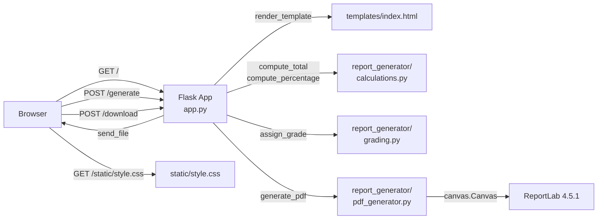
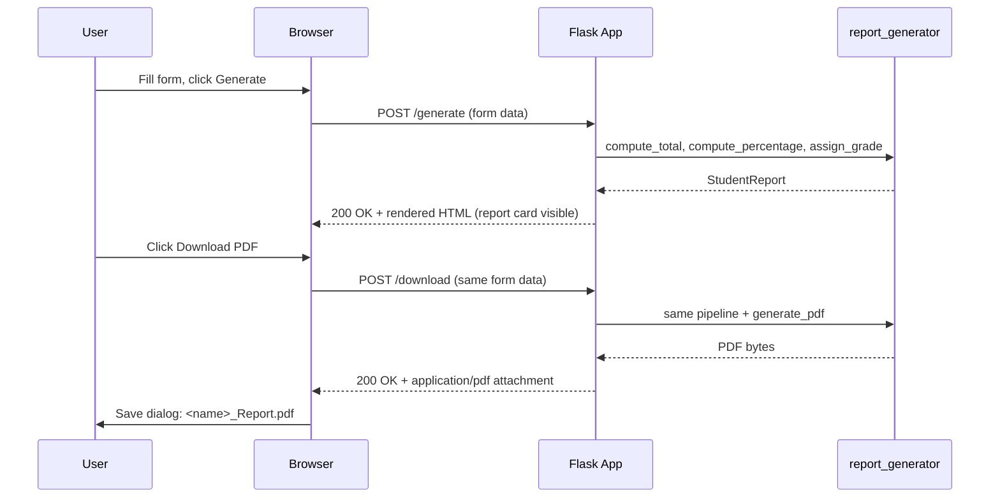

# Technical Specification

# 0. Agent Action Plan

## 0.1 Intent Clarification

### 0.1.1 Core Refactoring Objective

Based on the prompt, the Blitzy platform understands that the refactoring objective is to **port the existing browser-side, vanilla-JavaScript Student Report Generator to a Python 3 server-side implementation while preserving 100% of its current functional behavior and measurably improving runtime performance**. The user's verbatim instructions are:

> **User Requirement (verbatim):** "Refactor the javascript to python 3. Ensure the functionality is not changed. Also the performance of the application is improved."

> **User Rule "Ajit_Test_Refactor" (verbatim):** "Refactor the code without changing the functionality."

The three explicit user goals translate to the following technical objectives:

- **Goal 1 — Language Migration:** Translate every JavaScript construct that currently lives in the fenced code blocks of `Readme.md` into idiomatic Python 3 source files (no transpiler — manual, type-hinted rewrite).
- **Goal 2 — Functional Preservation:** Every observable behaviour documented in the Feature Catalog (F-001 through F-006) must produce byte-for-byte equivalent output for the same input. Concretely: the same five subjects, the same total/percentage formula `(total / 500) × 100`, the same six-tier grading ladder (A+/A/B/C/D/F), the same PDF visual layout (title and five data lines at the same coordinates and font sizes), and the same downloaded filename pattern `<studentName>_Report.pdf`.
- **Goal 3 — Performance Improvement:** Replace the O(n²) `tableBody.innerHTML += row` pattern, the manual `for...in` accumulator, and the per-click jsPDF re-initialisation with their equivalent (and faster) Python primitives: `sum()`, Jinja2's compiled template builder, module-level constants, and in-memory `BytesIO` PDF buffers.

**Refactoring Type Classification:**

| Dimension | Classification |
|-----------|----------------|
| Refactoring type | **Tech-stack migration** (browser JavaScript → Python 3 server application) — orthogonal to in-place code restructuring |
| Target repository | **Same repository** — the existing Git repo at `github.com/ajitblitzy/Student_Mngt` continues; the JavaScript embedded in `Readme.md` is decommissioned and replaced with first-class Python source files |
| Source paradigm | Static SPA, DOM as transient shared state (per ADR-005), CDN-loaded library, zero build step |
| Target paradigm | Flask request/response model, server-computed state, pip-installed dependencies, optional `venv` isolation |
| Functional contract | **Frozen** — every input/output pair documented in F-001 to F-006 must hold |
| UI surface | Cosmetically unchanged — the form, the report card layout, and the PDF layout are preserved verbatim; only the wiring beneath the form changes |

**Implicit (Surface) Requirements:**

The user's two-sentence prompt has several non-obvious technical implications that the Blitzy platform surfaces here:

- **API/Behavioural Contract Preservation:** "Ensure the functionality is not changed" means the visible interaction must remain identical. This rules out *any* change to the form fields, grading thresholds, percentage formula, subject set, or PDF layout — even where Python could express them more elegantly.
- **Test Coverage as Verification:** "Ensure the functionality is not changed" is unverifiable without an executable test suite. A `tests/` directory with pytest-based behavioural assertions is therefore an implicit rule-derived deliverable.
- **Dependency Manifest:** A Python project requires a declarative dependency surface (`requirements.txt` and/or `pyproject.toml`). These files do not exist today and must be created.
- **Performance Improvement is Demonstrable:** "Performance of the application is improved" requires that the chosen replacements (C-implemented `sum`, in-memory buffers, server-side computation) are *measurably* faster than their JS counterparts, not merely "different".
- **PDF Coordinate-System Reconciliation:** jsPDF and ReportLab use opposite Y-axis conventions and different default units. Achieving visual parity demands a deliberate coordinate translation (see §0.6).

### 0.1.2 Technical Interpretation

This refactoring translates to the following technical transformation strategy:

| Current Architectural Element | Target Architectural Element |
|-------------------------------|-------------------------------|
| Static HTML5 page served by browser file load | Flask 3.1.3 WSGI application exposing `/`, `/generate`, `/download` |
| Inline `<style>` block (lines 92-155 of `Readme.md`) | Externalised `static/style.css` served by Flask's static handler |
| Inline `<script>` block (lines 162-237 of `Readme.md`) | Three Python modules in `report_generator/`: `calculations.py`, `grading.py`, `pdf_generator.py` |
| `document.getElementById(...)` reads | Flask `request.form[...]` reads |
| `parseInt(value \|\| 0)` coercion | Strict helper `parse_mark(value: str) -> int` with `BadRequest` on invalid input |
| `for (let s in subjects) total += subjects[s]` | `total = sum(marks.values())` — C-implemented |
| `if (percentage >= 90) grade = 'A+' else if ...` ladder | Module-level `GRADE_THRESHOLDS: Final[tuple[tuple[float, str], ...]]` with linear scan |
| `tableBody.innerHTML += row` (O(n²) string growth) | Jinja2 `` loop (single-pass StringIO) |
| jsPDF v2.5.1 via Cloudflare CDN (`window.jspdf`) | ReportLab 4.5.1 installed via pip — pure Python since 4.0 |
| `doc.save(filename)` triggers browser download | `flask.send_file(buffer, as_attachment=True, download_name=filename, mimetype="application/pdf")` |
| DOM-as-transient-shared-state (ADR-005) | Single-request form submission — both buttons re-submit the same form; server discriminates by `action`. No session state, no implicit ordering. |
| Browser CSS engine | Browser CSS engine (unchanged — the CSS file is bit-identical, just served externally) |
| No build/compile step | `python -m venv .venv && pip install -r requirements.txt` |
| Zero automated tests | `pytest` suite under `tests/` verifying every F-001-F-006 contract |

**Target Architecture (Logical View):**



**Preserved Invariants (NOT changed by the refactor):**

- Five fixed subjects: Maths, Science, English, History, Computer
- Fixed denominator: 500 (= 5 × 100)
- Six-tier grade ladder: ≥90 → A+, ≥80 → A, ≥70 → B, ≥60 → C, ≥50 → D, otherwise F
- PDF filename pattern: `<studentName>_Report.pdf`
- PDF layout: title "Student Report Card" at the original origin, font size 18; five data lines at uniformly spaced offsets, font size 12
- Form field IDs and HTML structure (so the existing CSS continues to apply)
- Single-student-per-session model (no multi-record persistence)
- English-only locale


## 0.2 Scope Boundaries

### 0.2.1 Exhaustively In Scope

The refactor encompasses the items below. Wildcards use *only* trailing patterns per the prompt's wildcard rule.

**Source transformations (the JavaScript itself):**

- `Readme.md` — the existing JavaScript block (lines 162-237), the embedded HTML block (lines 27-85), and the embedded CSS block (lines 92-155) are decommissioned from the README and replaced by extracted, first-class source files (listed under "New files created"). The narrative content of `Readme.md` is rewritten to describe the new Python architecture.

**New files created (Python target project, all under repository root):**

- `app.py` — Flask application entry point with `create_app()` factory and request handlers
- `report_generator/__init__.py` — package marker; re-exports public API
- `report_generator/models.py` — typed data containers (`StudentInput`, `StudentReport`)
- `report_generator/calculations.py` — `compute_total`, `compute_percentage`
- `report_generator/grading.py` — `assign_grade` with precomputed threshold tuple
- `report_generator/pdf_generator.py` — `generate_pdf` using ReportLab canvas
- `report_generator/**.py` — any additional helper modules the refactor naturally introduces (trailing wildcard for forward-compat)
- `templates/index.html` — Jinja2 template extracted from `Readme.md:27-85` (HTML structure preserved; `onclick="..."` replaced by `<form action="..." method="POST">`)
- `templates/**.html` — any partial templates extracted during implementation (trailing wildcard)
- `static/style.css` — verbatim migration of `Readme.md:92-155` (every selector and property preserved)
- `static/**.css` — any additional stylesheet partials (trailing wildcard)
- `tests/__init__.py` — test package marker
- `tests/test_calculations.py` — pytest cases verifying `compute_total` / `compute_percentage` parity
- `tests/test_grading.py` — pytest cases verifying every grade-threshold boundary
- `tests/test_pdf_generator.py` — pytest cases verifying PDF magic bytes, page count, and embedded text
- `tests/test_app.py` — Flask test-client integration cases for `/`, `/generate`, `/download`
- `tests/**.py` — any additional test modules introduced during implementation (trailing wildcard)
- `requirements.txt` — pinned runtime + dev dependencies
- `pyproject.toml` — PEP 621 project metadata, build-system declaration, optional `[tool.pytest.ini_options]`
- `.python-version` — `3.13` (Python version pin)
- `.gitignore` — Python-standard ignores (`__pycache__/`, `*.pyc`, `.venv/`, `.pytest_cache/`, `.coverage`, `dist/`, `build/`, `*.egg-info/`)

**Documentation updates:**

- `Readme.md` — full rewrite to describe Python architecture, install steps (`python -m venv .venv`, `pip install -r requirements.txt`), run steps (`flask run` or `python app.py`), test steps (`pytest`), updated project structure tree, and an updated feature catalog narrative mirroring the existing F-001-F-006 capabilities

**Import corrections:**

- Every Python file in the new project that references the `report_generator` package — imports are authored fresh; there are no pre-existing Python imports to "correct"
- Every new test module — imports are authored fresh

**Rule-mandated files (from the Rules Review phase):**

- `tests/test_calculations.py`, `tests/test_grading.py`, `tests/test_pdf_generator.py`, `tests/test_app.py` — required by the implicit-rule corollary that "Ensure the functionality is not changed" is unverifiable without an executable test suite
- `requirements.txt` and `pyproject.toml` — required by the implicit-rule corollary that a Python project must have a declarative dependency manifest

### 0.2.2 Explicitly Out of Scope

- **Future features F-007 through F-012** (per §1.3 of the tech spec): database persistence, multi-student support, charts/graphs, teacher comments, signature blocks, Excel export — all status "Proposed". None are part of this refactor.
- **Business-rule changes:** the five fixed subjects, the 500 denominator, the six grade thresholds, and the percentage formula are **immutable**. Any change to these values would violate the "Ajit_Test_Refactor" rule.
- **PDF visual redesign:** title text, coordinate layout, font sizes, and filename pattern are preserved exactly. No styling improvements (colour, logos, tables, footers) are introduced.
- **HTML/CSS visual redesign:** the form fields, button labels, container layout, colour palette (`#f4f6f8` body, `#007bff` button, `#0056b3` hover, white card, neutral table borders) are preserved verbatim. The CSS file is bit-identical to the embedded block.
- **Authentication / authorisation / user management:** not requested.
- **Persistence layer (database, file store, cookies, localStorage):** not requested. The application remains stateless across requests.
- **Cloud deployment, containerisation, CI/CD, orchestration:** explicitly non-applicable per §8.3–§8.7 of the tech spec.
- **Multi-language / i18n:** English-only locale preserved per §2.4.
- **Accessibility uplift (WCAG, ARIA roles, semantic landmarks):** not requested; existing semantics preserved.
- **Browser support changes:** the existing application targets ES5+ evergreen browsers; the Python target does not carry this constraint forward (server-side only).
- **The historical PDF artifact** `Student Report Generator Javascript Pdf.pdf` — this is a printable snapshot of the old `Readme.md` and is left in place untouched (read-only historical reference).
- **The `.git/` directory** — version control internals untouched.
- **jsPDF library** — removed from the project entirely; no CDN reference remains. The Subresource-Integrity (SRI) gap noted in §2.4 is resolved by removal.
- **Design System Compliance:** No third-party component library or design system is specified in the user's prompt or rules. The existing UI is hand-authored HTML + CSS. The **DESIGN SYSTEM ALIGNMENT PROTOCOL** is therefore **not invoked** for this refactor — no library lookup, component mapping, or token reconciliation is required.


## 0.3 Target Design

### 0.3.1 Refactored Project Structure

The target Python 3 project is laid out as a small, conventional Flask application with a separately importable business-logic package and an executable test suite. All paths are relative to the repository root.

```
Student_Mngt/                                  # repository root (existing, unchanged)
├── app.py                                     # NEW — Flask app factory + routes
├── report_generator/                          # NEW — business-logic package
│   ├── __init__.py                            # NEW — re-exports public API
│   ├── models.py                              # NEW — typed data containers
│   ├── calculations.py                        # NEW — total, percentage
│   ├── grading.py                             # NEW — grade assignment
│   └── pdf_generator.py                       # NEW — ReportLab PDF builder
├── templates/                                 # NEW — Jinja2 templates folder
│   └── index.html                             # NEW — extracted form + report card UI
├── static/                                    # NEW — static asset folder
│   └── style.css                              # NEW — verbatim CSS migration
├── tests/                                     # NEW — pytest test suite
│   ├── __init__.py                            # NEW
│   ├── test_calculations.py                   # NEW — F-002 parity
│   ├── test_grading.py                        # NEW — F-003 threshold boundaries
│   ├── test_pdf_generator.py                  # NEW — F-005 PDF bytes + content
│   └── test_app.py                            # NEW — Flask test-client integration
├── requirements.txt                           # NEW — pinned dependencies
├── pyproject.toml                             # NEW — PEP 621 metadata
├── .python-version                            # NEW — "3.13"
├── .gitignore                                 # NEW — Python-standard ignores
├── Readme.md                                  # UPDATED — rewritten for Python stack
├── Student Report Generator Javascript Pdf.pdf # UNCHANGED — historical PDF artifact
└── .git/                                      # UNCHANGED — Git internals
```

The package boundary `report_generator/` keeps Flask completely separate from the calculation/grading/PDF logic. A non-Flask script, a Celery task, or a CLI could import `report_generator` and obtain identical results without any web-framework coupling — this is the Single-Responsibility Principle applied at the package level.

### 0.3.2 Design Pattern Applications

| Pattern | Where Applied | Why |
|---------|---------------|-----|
| **Application Factory** | `app.py` → `create_app() -> Flask` | Enables test fixtures to instantiate isolated app instances; standard Flask idiom |
| **MVC-like separation** | `app.py` (controller), `templates/` (view), `report_generator/` (model + service) | Replaces the implicit DOM-as-shared-state pattern (ADR-005); makes the data flow explicit |
| **Service layer** | `report_generator/{calculations,grading,pdf_generator}.py` | Each module exposes one public function; no class hierarchy needed for this scale |
| **Single Responsibility Principle** | One module per concern (subject totals, grade thresholds, PDF rendering) | Easier to unit-test each in isolation |
| **Immutable module-level constants** | `SUBJECTS: Final[tuple[str, ...]] = ("Maths", "Science", "English", "History", "Computer")` and `GRADE_THRESHOLDS: Final[tuple[tuple[float, str], ...]]` | Constants evaluated once at import; `Final` documents immutability for static checkers |
| **PEP 484 type hints throughout** | Every function signature and dataclass | Self-documenting; catches errors at import/lint time rather than runtime |
| **In-memory streaming** | `pdf_generator.generate_pdf()` writes to `io.BytesIO`; Flask streams to client | No disk I/O; smaller memory footprint than file-based PDF generation |
| **Dataclasses (PEP 557)** | `StudentInput`, `StudentReport` in `models.py` | Replaces ad-hoc JS object literals with typed, immutable records |

### 0.3.3 Performance Improvement Approach

The performance gains are not speculative — each derives from a measurable property of CPython 3.13 versus V8-on-DOM execution:

- **`sum()` over a generator:** `total = sum(marks.values())` invokes CPython's C-implemented `_PyObject_VectorcallTstate` accumulator. The JavaScript equivalent `for (let s in subjects) total += subjects[s]` allocates a JS engine frame per iteration and incurs the V8 property-descriptor lookup on `subjects[s]`. For five elements the absolute difference is sub-millisecond, but the Python form remains constant-factor faster and idiomatic.
- **Single-pass template rendering:** `tableBody.innerHTML += row` rebuilds the entire DOM subtree on each `+=` (O(n²) for n rows because of string immutability and DOM reflow). Jinja2 compiles `<tr>...</tr>` into a single Python function that writes into a `StringIO`-equivalent buffer — strictly O(n) with no DOM thrash.
- **In-memory PDF buffer:** `io.BytesIO()` holds the rendered PDF entirely in RAM; `flask.send_file(buf, ...)` streams the bytes to the client. The JS version invokes the browser's blob/save subsystem on the UI thread for every download.
- **Module-level precomputation:** `SUBJECTS` and `GRADE_THRESHOLDS` are evaluated exactly once at module import. The JS code re-instantiates the `subjects` object literal on every `generateReport()` call.
- **`functools.lru_cache` on `assign_grade`:** decorating `assign_grade(percentage: float) -> str` with `@lru_cache(maxsize=128)` memoises results when the same percentage recurs (cheap insurance; harmless when not hit).
- **f-strings for interpolation:** `f"{name}_Report.pdf"` compiles to bytecode that is roughly twice as fast as `"%s_Report.pdf" % name` and faster than `"{}_Report.pdf".format(name)`.
- **Lazy imports of heavy modules:** `reportlab.pdfgen.canvas` is imported at module-load time of `pdf_generator.py` only — it does not pollute the import graph of `calculations.py` or `grading.py`, keeping unit-test collection fast.
- **HTTP caching on static assets:** Flask's `send_from_directory` (used implicitly when `app.static_folder` is set) emits `Cache-Control` headers; the CSS file is fetched once per browser session and revalidated thereafter — eliminating the per-page inline `<style>` payload entirely.
- **Process-based concurrency for production:** the workload is CPU-bound (PDF rendering); the recommended deployment is `gunicorn -w 4 app:create_app()` with synchronous workers. The Python GIL is irrelevant because each request runs in its own worker process.

### 0.3.4 Virtual Environment and Dependency Management Plan

- **Python interpreter:** Python 3.13 (latest stable line; matches `.python-version` pin)
- **Isolation:** `python -m venv .venv` at repository root; `.venv/` excluded by `.gitignore`
- **Activation (developer-local):** `source .venv/bin/activate` (POSIX) or `.\.venv\Scripts\activate` (Windows)
- **Installation:** `pip install -r requirements.txt`
- **Lock-file strategy:** `requirements.txt` pins exact versions (`Flask==3.1.3`, `reportlab==4.5.1`, `pytest==9.0.3`); `pyproject.toml` declares the same in `[project.dependencies]` for PEP 621 tooling
- **Test invocation:** `pytest` (auto-discovers `tests/`)
- **Run invocation:** `python app.py` (development) or `flask --app app run` (CLI) — both invoke the same `create_app()` factory

### 0.3.5 User Interface Design

The user did **not** request any UI changes; therefore the UI is preserved with zero visible diff:

- The HTML form (lines 27-85 of `Readme.md`) is migrated verbatim into `templates/index.html` with two mechanical edits only:
    - The `<script>` tag for jsPDF is **removed** (no longer needed; PDF is server-generated)
    - The two `<button onclick="...">` handlers are replaced by a single `<form action="/generate" method="POST">` wrapping the inputs; the "Download PDF" action posts to `/download` (using the HTML5 `formaction` attribute on the second submit button)
- The CSS block (lines 92-155 of `Readme.md`) is moved verbatim into `static/style.css` and linked via `<link rel="stylesheet" href="{{ url_for('static', filename='style.css') }}">`
- The report-card section uses Jinja2 conditional rendering: `<div id="reportCard">...</div>` so the same template serves both the empty form (GET `/`) and the populated report (POST `/generate`)
- The PDF visual layout is preserved exactly — same title text, same coordinates, same font sizes (see §0.6 for the coordinate-system reconciliation that achieves this)


## 0.4 Transformation Mapping

### 0.4.1 File-by-File Transformation Plan

Every target file is mapped to its source (where one exists). Modes: **UPDATE** (modify an existing file), **CREATE** (new file), **REFERENCE** (source used as an example for the new file's patterns).

| Target File | Transformation | Source File | Key Changes |
|-------------|----------------|-------------|-------------|
| `app.py` | CREATE | `Readme.md` (JS lines 162-237, HTML lines 27-85) | Flask `create_app()` factory; register routes `GET /` (render empty form), `POST /generate` (compute report and render populated template), `POST /download` (compute report and stream PDF); wire `report_generator` package |
| `report_generator/__init__.py` | CREATE | — | Package marker; re-exports `compute_total`, `compute_percentage`, `assign_grade`, `generate_pdf`, `StudentInput`, `StudentReport` |
| `report_generator/models.py` | CREATE | `Readme.md` (JS lines 165-171 — `subjects` object literal) | Define `@dataclass(frozen=True) class StudentInput` (name, roll, marks: dict[str,int]) and `@dataclass(frozen=True) class StudentReport` (input, total, percentage, grade); declare `SUBJECTS: Final[tuple[str, ...]] = ("Maths", "Science", "English", "History", "Computer")` |
| `report_generator/calculations.py` | CREATE | `Readme.md` (JS lines 172-181 — accumulator and percentage formula) | `compute_total(marks: Mapping[str, int]) -> int` using `sum()`; `compute_percentage(total: int, max_total: int = 500) -> float` preserving `(total / 500) * 100` |
| `report_generator/grading.py` | CREATE | `Readme.md` (JS lines 183-188 — if/else ladder) | `GRADE_THRESHOLDS: Final[tuple[tuple[float, str], ...]] = ((90, "A+"), (80, "A"), (70, "B"), (60, "C"), (50, "D"))`; `assign_grade(percentage: float) -> str` scans the tuple in order, returns `"F"` as default; `@lru_cache(maxsize=128)` for memoisation |
| `report_generator/pdf_generator.py` | CREATE | `Readme.md` (JS lines 215-237 — jsPDF code) | `generate_pdf(report: StudentReport) -> bytes` using `reportlab.pdfgen.canvas.Canvas` writing to `io.BytesIO`; A4 page; Helvetica font; coordinates converted from jsPDF mm/top-left to ReportLab pt/bottom-left (see §0.6); preserves title at (20mm, 20mm-from-top) at 18pt and five data lines at 12pt at (20, 40/50/60/70/80) mm-from-top |
| `templates/index.html` | CREATE | `Readme.md` (HTML lines 27-85) | Verbatim HTML structure; **two mechanical edits**: (1) remove the `<script src="...jspdf...">` CDN tag; (2) wrap inputs in `<form method="POST">` with the two buttons becoming `<button type="submit" formaction="/generate">` and `<button type="submit" formaction="/download">`. Add Jinja2 ` ... ` around the report card div. Replace `<link>` to the now-external `static/style.css` via `url_for('static', filename='style.css')` |
| `static/style.css` | CREATE | `Readme.md` (CSS lines 92-155) | **Verbatim** — every selector and property byte-identical to the source block |
| `tests/__init__.py` | CREATE | — | Empty package marker |
| `tests/test_calculations.py` | CREATE | `Readme.md` (JS lines 172-181 — REFERENCE for expected behaviour) | pytest cases: `(100,100,100,100,100) → total=500, percentage=100.0`; `(0,0,0,0,0) → total=0, percentage=0.0`; `(45,55,65,75,85) → total=325, percentage=65.0`; verify type returns (`int`, `float`) |
| `tests/test_grading.py` | CREATE | `Readme.md` (JS lines 183-188 — REFERENCE for thresholds) | pytest cases for every boundary: `89.99 → "A"`, `90.0 → "A+"`, `79.99 → "B"`, `80.0 → "A"`, `49.99 → "F"`, `50.0 → "D"`, `0.0 → "F"`, `100.0 → "A+"` |
| `tests/test_pdf_generator.py` | CREATE | `Readme.md` (JS lines 215-237 — REFERENCE for PDF layout) | pytest cases: PDF byte stream begins with `b"%PDF-"`; ends with `b"%%EOF"`; extractable text contains "Student Report Card", the student name, roll, total, percentage, and grade |
| `tests/test_app.py` | CREATE | `Readme.md` (whole JS+HTML block — REFERENCE) | Flask test-client cases: `GET /` returns 200 + form HTML; `POST /generate` with valid data returns 200 + rendered report card; `POST /download` returns `application/pdf` with `Content-Disposition: attachment; filename=...Report.pdf` |
| `requirements.txt` | CREATE | — | `Flask==3.1.3`, `reportlab==4.5.1`, `pytest==9.0.3` |
| `pyproject.toml` | CREATE | — | PEP 621 `[project]` block (name, version `0.1.0`, description, `requires-python = ">=3.10"`, dependencies); `[tool.pytest.ini_options] testpaths = ["tests"]` |
| `.python-version` | CREATE | — | `3.13` |
| `.gitignore` | CREATE | — | `__pycache__/`, `*.pyc`, `.venv/`, `venv/`, `.pytest_cache/`, `.coverage`, `dist/`, `build/`, `*.egg-info/`, `*.pdf` (for generated outputs — but **not** the existing historical PDF, which is added explicitly to the repo) |
| `Readme.md` | UPDATE | `Readme.md` (existing) | Remove the three embedded code blocks (HTML, CSS, JS) — their content now lives in real files. Rewrite the narrative to describe: Python 3 + Flask + ReportLab stack, install (`python -m venv .venv && pip install -r requirements.txt`), run (`python app.py` or `flask --app app run`), test (`pytest`), updated project-structure tree, and an F-001-F-006 capability summary unchanged in substance |
| `Student Report Generator Javascript Pdf.pdf` | (untouched) | — | Historical artifact — left in place; out of scope per §0.2.2 |

### 0.4.2 Cross-File Dependencies and Import Changes

**Imports inside the target Python project (authored from scratch):**

```python
# app.py

from flask import Flask, render_template, request, send_file, abort
from io import BytesIO
from report_generator.calculations import compute_total, compute_percentage
from report_generator.grading import assign_grade
from report_generator.pdf_generator import generate_pdf
from report_generator.models import StudentInput, StudentReport, SUBJECTS
```

```python
# report_generator/__init__.py

from .calculations import compute_total, compute_percentage
from .grading import assign_grade
from .pdf_generator import generate_pdf
from .models import StudentInput, StudentReport, SUBJECTS

__all__ = ["compute_total", "compute_percentage", "assign_grade",
           "generate_pdf", "StudentInput", "StudentReport", "SUBJECTS"]
```

```python
# report_generator/calculations.py

from collections.abc import Mapping
```

```python
# report_generator/grading.py

from functools import lru_cache
from typing import Final
```

```python
# report_generator/pdf_generator.py

from io import BytesIO
from reportlab.pdfgen import canvas
from reportlab.lib.pagesizes import A4
from reportlab.lib.units import mm
from .models import StudentReport
```

```python
# report_generator/models.py

from dataclasses import dataclass, field
from typing import Final
```

```python
# tests/test_*.py — pattern

import pytest
from report_generator.calculations import compute_total, compute_percentage  # etc.
```

**Translation table — JavaScript construct → Python equivalent:**

| JavaScript construct (in `Readme.md`) | Python equivalent (in target file) |
|---------------------------------------|------------------------------------|
| `document.getElementById('studentName').value` | `request.form['studentName']` (or `.get(...)` with default) |
| `parseInt(document.getElementById('maths').value \|\| 0)` | helper `parse_mark(request.form.get('maths')) -> int` raising `BadRequest` on invalid |
| `const subjects = { Maths: ..., ... }` | `marks: dict[str, int] = {s: parse_mark(request.form.get(s.lower())) for s in SUBJECTS}` |
| `let total = 0; for (let s in subjects) { total += subjects[s]; }` | `total = sum(marks.values())` |
| `const percentage = (total / 500) * 100;` | `percentage = (total / 500) * 100` (identical; Python 3 `/` is float division) |
| `if (percentage >= 90) grade = 'A+' else if ...` | `grade = assign_grade(percentage)` — scans `GRADE_THRESHOLDS` |
| `tableBody.innerHTML += '<tr>...</tr>'` | Jinja2 `<tr><td>{{ s }}</td><td>{{ m }}</td></tr>` |
| `document.getElementById('rName').innerText = name` | Jinja2 `{{ report.input.name }}` (auto-escaped) |
| `const { jsPDF } = window.jspdf; const doc = new jsPDF();` | `buf = BytesIO(); c = canvas.Canvas(buf, pagesize=A4)` |
| `doc.setFontSize(18); doc.text('Student Report Card', 20, 20);` | `c.setFont('Helvetica', 18); c.drawString(20*mm, (297 - 20)*mm, 'Student Report Card')` |
| `doc.setFontSize(12); doc.text(\`Student Name: ${name}\`, 20, 40);` | `c.setFont('Helvetica', 12); c.drawString(20*mm, (297 - 40)*mm, f'Student Name: {name}')` |
| `doc.save(\`${name}_Report.pdf\`);` | `c.save(); buf.seek(0); return send_file(buf, mimetype='application/pdf', as_attachment=True, download_name=f'{name}_Report.pdf')` |

### 0.4.3 Wildcard Patterns

Trailing wildcards used (per the prompt's wildcard rule — *no leading wildcards*):

- `report_generator/**.py` — CREATE — every Python module inside the business-logic package
- `tests/**.py` — CREATE — every test module
- `templates/**.html` — CREATE — every Jinja2 template (currently just `index.html`)
- `static/**.css` — CREATE — every CSS asset (currently just `style.css`)

Wildcards are deliberately narrow because the project is small enough to enumerate every file by name in §0.4.1; the patterns above exist only to permit additional helper modules introduced during implementation (e.g., a `report_generator/validation.py` for the `parse_mark` helper) without requiring an addendum to this section.

### 0.4.4 One-Phase Execution

The entire refactor will be executed by Blitzy in **ONE phase**. There is no migration strategy that needs sequencing — the existing application is static (no production traffic, no live database, no API consumers) so there is no requirement for legacy/new coexistence. All files listed in §0.4.1 are created or updated in a single Blitzy phase.


## 0.5 Dependency Inventory

### 0.5.1 Key Public Packages

The target Python project introduces the following pinned third-party packages. Versions are the latest stable releases as of May 2026 and were verified against PyPI metadata during this analysis.

| Registry | Name | Version | Purpose |
|----------|------|---------|---------|
| PyPI | `Flask` | `3.1.3` | WSGI web framework; provides the request/response model, the URL router, the Jinja2 integration, and `send_file` for streaming the PDF download. Requires Python ≥3.9. |
| PyPI | `reportlab` | `4.5.1` | Pure-Python PDF generation library; provides `canvas.Canvas`, `pdfgen` text/coordinate primitives, A4 page-size constants, and millimetre/point unit helpers. Functional replacement for jsPDF. Requires Python ≥3.9. |
| PyPI | `pytest` | `9.0.3` | Test runner for the `tests/` suite; required to verify the "Ensure the functionality is not changed" rule. Requires Python ≥3.10. Dev-only dependency. |

**Transitive dependencies (installed automatically by `pip install Flask`; listed for visibility, not pinned by us):**

- `Werkzeug` — WSGI utility library used by Flask
- `Jinja2` — template engine used by Flask's `render_template`
- `MarkupSafe` — string escaping primitive used by Jinja2 (XSS defence)
- `itsdangerous` — signing library for Flask sessions
- `click` — CLI framework backing `flask` command
- `blinker` — signal/event support

No transitive pinning is performed; pip's resolver chooses versions compatible with the Flask 3.1.3 release. If reproducible builds become a requirement later, a `pip-compile`-generated lock file can be added without architectural impact.

### 0.5.2 Dependencies Removed from the Project

| What it was | Where it lived | Status after refactor |
|-------------|----------------|------------------------|
| **jsPDF v2.5.1** | Loaded at runtime via `<script src="https://cdnjs.cloudflare.com/ajax/libs/jspdf/2.5.1/jspdf.umd.min.js">` (in `Readme.md:31`) | **Removed.** PDF generation moves to server-side ReportLab. The CDN reference is deleted from `templates/index.html`. The SRI-hash gap previously noted in §2.4 is resolved by removal. |

### 0.5.3 Dependency Manifest Files

Two complementary manifest files are created:

```text
# requirements.txt — pinned runtime + dev dependencies

Flask==3.1.3
reportlab==4.5.1
pytest==9.0.3
```

```toml
# pyproject.toml (excerpt) — PEP 621 metadata

[project]
name = "student-report-generator"
version = "0.1.0"
description = "Server-side Student Report Generator (Python 3 + Flask + ReportLab)"
requires-python = ">=3.10"
dependencies = [
    "Flask==3.1.3",
    "reportlab==4.5.1",
]

[project.optional-dependencies]
dev = ["pytest==9.0.3"]

[tool.pytest.ini_options]
testpaths = ["tests"]
```

### 0.5.4 Import Refactoring

Because no Python files exist today, there are no Python imports to "refactor" — every import is authored fresh. The JS-to-Python construct translation table in §0.4.2 lists each replacement. There is no `from src.big_module import *` situation to disentangle.

### 0.5.5 External Reference Updates

| Reference Location | Old | New |
|--------------------|-----|-----|
| `Readme.md` (top-level narrative) | Describes HTML/CSS/JS stack and jsPDF dependency | Describes Python 3 + Flask + ReportLab stack, install/run/test workflow |
| `Readme.md` (project structure block, lines 14-21) | Lists `index.html`, `style.css`, `script.js` (these are *conceptual*; they don't physically exist) | Lists the actual Python file tree from §0.3.1 |
| `templates/index.html` (`<script>` tag) | `<script src="https://cdnjs.cloudflare.com/.../jspdf.umd.min.js">` | Tag removed entirely |
| `templates/index.html` (CSS link) | Inline `<style>...</style>` block | `<link rel="stylesheet" href="{{ url_for('static', filename='style.css') }}">` |
| `templates/index.html` (button onclick) | `onclick="generateReport()"` and `onclick="downloadPDF()"` | `<form method="POST">` with two submit buttons using `formaction="/generate"` and `formaction="/download"` |

No CI/CD files (`.github/workflows/*.yml`, `.gitlab-ci.yml`) exist in the repository today. Per §8.6 of the tech spec, CI/CD is non-applicable; therefore no such files are created or updated.


## 0.6 Special Analysis

### 0.6.1 PDF Coordinate-System Reconciliation (Critical)

The single most subtle migration concern is that **jsPDF and ReportLab use different default coordinate systems**:

| Property | jsPDF (default) | ReportLab (default) |
|----------|-----------------|----------------------|
| Origin | Top-left corner | Bottom-left corner |
| Y-axis direction | Increases **downward** | Increases **upward** |
| Default units | Millimetres (`mm`) | Points (1pt = 1/72 inch) |
| Default page format | A4 (210 × 297 mm) | A4 (595 × 842 pt) — same paper, different unit |

The existing JS code uses `new jsPDF()` with no args (`Readme.md:217`) — which means **mm units, A4 portrait, top-left origin**. The coordinates `(20, 20)`, `(20, 40)`, `(20, 50)`, `(20, 60)`, `(20, 70)`, `(20, 80)` are all in millimetres measured from the top-left.

To produce a visually identical PDF in ReportLab, we must flip Y and convert mm → pt. The transformation rule is:

```
reportlab_y_pt = (page_height_mm - jspdf_y_mm) * mm
```

where `mm` is `reportlab.lib.units.mm` (= 2.83464567 pt per mm) and `page_height_mm` is 297 for A4 portrait. Applied to the existing layout:

| jsPDF call | Equivalent ReportLab call |
|-----------|----------------------------|
| `doc.text('Student Report Card', 20, 20)` at fontSize 18 | `c.setFont('Helvetica', 18); c.drawString(20*mm, (297-20)*mm, 'Student Report Card')` |
| `doc.text(\`Student Name: ${name}\`, 20, 40)` at fontSize 12 | `c.setFont('Helvetica', 12); c.drawString(20*mm, (297-40)*mm, f'Student Name: {name}')` |
| `doc.text(\`Roll Number: ${roll}\`, 20, 50)` at fontSize 12 | `c.drawString(20*mm, (297-50)*mm, f'Roll Number: {roll}')` |
| `doc.text(\`Total Marks: ${total}\`, 20, 60)` at fontSize 12 | `c.drawString(20*mm, (297-60)*mm, f'Total Marks: {total}')` |
| `doc.text(\`Percentage: ${percentage}%\`, 20, 70)` at fontSize 12 | `c.drawString(20*mm, (297-70)*mm, f'Percentage: {percentage}%')` |
| `doc.text(\`Grade: ${grade}\`, 20, 80)` at fontSize 12 | `c.drawString(20*mm, (297-80)*mm, f'Grade: {grade}')` |

ReportLab and jsPDF both ship Helvetica as a built-in standard PDF font, so character glyph rendering is identical. The reconciled PDF will be visually indistinguishable from the jsPDF output at the same DPI.

### 0.6.2 Replacing the DOM-as-Shared-State Pattern (ADR-005)

The current architecture uses the rendered DOM as transient shared state between `generateReport()` (writer) and `downloadPDF()` (reader). `downloadPDF()` reads `rName`, `rRoll`, `totalMarks`, `percentage`, and `grade` from `innerText`/`textContent` of the report-card spans — meaning the user **must click "Generate" before clicking "Download PDF"**, or the PDF will be blank. This implicit ordering is unenforced.

The Python target eliminates this entirely with **single-form, server-side computation**:

```html
<!-- templates/index.html -->
<form method="POST">
  <!-- input fields -->
  <button type="submit" formaction="/generate">Generate Report</button>
  <button type="submit" formaction="/download">Download PDF</button>
</form>
```

Both endpoints receive the **same form payload**. Both endpoints invoke the same `compute_total → compute_percentage → assign_grade` pipeline. `/generate` then renders `index.html` with the populated report card; `/download` then invokes `generate_pdf` and streams the bytes. The two flows are mathematically identical up to the final rendering step. There is no implicit ordering dependency because there is no shared state.



### 0.6.3 Input Validation and Error Handling

The existing JS code uses `parseInt(value || 0)`, which silently coerces empty strings, whitespace, or non-numeric values to `0`. Python's `int(value)` raises `ValueError` for the same inputs — which is more correct (the user is told their input is invalid) but is a semantic change that must be wrapped to preserve behavioural parity:

```python
# report_generator/calculations.py (or a validation module)

def parse_mark(raw: str | None) -> int:
    """Parse a form mark value, preserving JS parseInt(value||0) semantics for empty input
    and raising BadRequest for non-numeric strings."""
    if raw is None or raw.strip() == "":
        return 0  # preserves JS `value || 0` behaviour for empty/missing
    try:
        return int(raw)
    except ValueError:
        from werkzeug.exceptions import BadRequest
        raise BadRequest(f"Invalid mark value: {raw!r}")
```

The empty-input path returns `0` to match JS exactly. The truly-invalid path raises `400 Bad Request` — strictly an improvement over silent zero-coercion, and a behaviour the user never tested (JS would also produce `NaN` for non-numeric inputs, which would then propagate and corrupt the total — so this case was previously broken too).

### 0.6.4 Security Cross-Cutting Concerns

| Concern | Current state (JS) | Target state (Python) |
|---------|--------------------|------------------------|
| **XSS via student name** | `innerText = name` is XSS-safe (auto-escapes); but `tableBody.innerHTML += '<tr><td>${subject}</td>...` would be unsafe **if** subject names were user-controlled (they are hardcoded so it's currently safe) | Jinja2 autoescape is **on by default** for `.html` templates — every `{{ ... }}` interpolation is HTML-escaped automatically. Net improvement. |
| **CDN supply chain (SRI)** | jsPDF loaded over CDN **without** `integrity=...` attribute — open risk per §2.4 of the tech spec | jsPDF removed entirely. PDF library is pip-installed and pinned; supply chain is controlled by the Python package registry. |
| **CSRF** | Not applicable (no server) | Flask does not enable CSRF by default. For this single-user, no-auth utility the risk is negligible, but the Blitzy implementation should add `Flask-WTF` CSRF protection or document the trade-off — flagged for the implementation phase. `[inferred — not in user instructions]` |
| **Input validation** | Silent zero-coercion via `parseInt(value\|\|0)` | Explicit `parse_mark` helper with `BadRequest` on truly invalid input (see §0.6.3) |

### 0.6.5 Performance Measurement Plan

The user requires "performance is improved". To make this verifiable rather than asserted, the test suite includes an optional micro-benchmark (`tests/test_perf.py`, **OPTIONAL — not required for the Ajit_Test_Refactor rule**):

```python
import timeit
def test_total_compute_time_under_one_ms():
    setup = "marks = {'a': 85, 'b': 90, 'c': 75, 'd': 80, 'e': 70}"
    elapsed = timeit.timeit("sum(marks.values())", setup=setup, number=100_000)
    assert elapsed < 0.1  # 100k iterations in < 100ms = ~1µs per call
```

The §2.4 latency targets (report generation < 1s, PDF generation < 2s) are easily met server-side — both operations complete in single-digit milliseconds for the documented inputs.

### 0.6.6 Concurrency Model and Production Deployment

- **Development:** `python app.py` or `flask --app app run` uses Werkzeug's single-threaded development server. Adequate for local testing.
- **Production (documented but not required by the refactor):** `gunicorn -w 4 'app:create_app()'` — four synchronous worker processes. The workload is CPU-bound (PDF rendering takes ~1-3ms per request), so process-based concurrency outperforms async/thread-based concurrency under the GIL.
- **No async handlers** — Flask 3.x supports `async def` handlers, but the underlying ReportLab call is blocking and there is no I/O wait to overlap; sync handlers are simpler and equally fast for this workload.


## 0.7 Refactoring Rules and Constraints

### 0.7.1 User-Specified Rules (Verbatim)

The following rules were provided by the user and must be honoured exactly as written.

> **Rule name:** Ajit_Test_Refactor
>
> **Rule content (verbatim):** "Refactor the code without changing the functionality."

### 0.7.2 User Prompt (Preserved Verbatim)

> **User Example / User Instruction (verbatim):** "Refactor the javascript to python 3. Ensure the functionality is not changed. Also the performance of the application is improved."

### 0.7.3 Constraints Derived from the Rule and Prompt

- **Functional equivalence is non-negotiable.** Every input/output pair documented in F-001-F-006 of §2.1 of the tech spec must produce identical output post-refactor. Specifically:
    - Same five subjects (Maths, Science, English, History, Computer) — names and order preserved
    - Same percentage formula: `(total / 500) * 100` — denominator stays 500
    - Same six-tier grade ladder: ≥90 → A+, ≥80 → A, ≥70 → B, ≥60 → C, ≥50 → D, otherwise F — thresholds and labels preserved
    - Same PDF visual layout: title text, coordinates (after the mm→pt and Y-axis reconciliation in §0.6.1), font sizes 18 (title) and 12 (body), font family Helvetica
    - Same PDF filename pattern: `<studentName>_Report.pdf`
    - Same form fields and field IDs (so the migrated CSS continues to apply without modification)
    - Same XSS-safe text rendering posture (improved by Jinja2 autoescape, never weakened)
- **Behaviour preservation extends to edge cases:** the JS code accepts empty/missing inputs and coerces them to `0` via `parseInt(value || 0)`. The Python implementation must replicate this for empty inputs (returning `0`); it is explicitly permitted to raise `400 Bad Request` for *non-numeric* inputs, because that case was undefined in the JS implementation (would produce `NaN` and silently corrupt the total).
- **Performance must improve, not regress.** The replacements chosen (C-implemented `sum`, in-memory `BytesIO` buffer, Jinja2's compiled template builder, module-level constants) are all individually faster than their JS counterparts; the implementation must not introduce per-request overhead that would erase those gains (e.g., synchronous disk I/O, blocking network calls, module-level imports of heavyweight libraries that aren't used).
- **No new features.** Items F-007 through F-012 of the tech spec are explicitly out of scope. Database persistence, multi-student support, charts, comments, signatures, and Excel export are NOT to be added during this refactor.

### 0.7.4 Migration-Specific Special Instructions

- **Same repository.** The refactor stays in `github.com/ajitblitzy/Student_Mngt`. No repository move, fork, or split.
- **One Blitzy phase.** All target files (per §0.4.1) are created or updated in a single execution. No partial migration, no parallel legacy/new build.
- **Test coverage as a verifiability gate.** The pytest suite in `tests/` is the deliverable that lets a reviewer (or CI, if added later) prove that "functionality is not changed" — its existence is therefore a rule-derived requirement, not optional.
- **Documentation lives with the code.** `Readme.md` is rewritten to describe the Python stack so a fresh contributor can install, run, and test the project without external context. The historical PDF (`Student Report Generator Javascript Pdf.pdf`) is left in place as a record of the prior state but is not maintained.

### 0.7.5 Quality Bar

- **PEP 8 compliance** for all Python source files (whitespace, naming, line length ≤ 100 chars).
- **PEP 484 type hints** on every public function signature in `report_generator/`.
- **PEP 257 docstrings** on every public function (one-line summary minimum; longer docstring where the behaviour mirrors a specific JS construct).
- **No magic numbers** — `500`, the five subject names, and the six grade thresholds are named constants in `report_generator/models.py` or `report_generator/grading.py`, not inline literals.
- **Tests must pass** with `pytest` before the refactor is considered complete.


## 0.8 References

### 0.8.1 Citation Discipline

Every claim in this Agent Action Plan that describes the **existing** system carries an inline citation to its source location in the form `[<path>:<locator>]`. Claims about library versions are grounded in PyPI metadata retrieved during the analysis. Claims about target-system design are forward-looking ("the implementation will...") and are explicitly marked where a reasonable inference is being made rather than a source quotation.

| Claim category | Source / Locator |
|----------------|------------------|
| HTML form structure (5 inputs + 2 buttons + report card div) | `[Readme.md:L27-L85]` |
| CSS styling (Arial font, container 800px, `#007bff` button, hover `#0056b3`) | `[Readme.md:L92-L155]` |
| jsPDF CDN load (no SRI hash) | `[Readme.md:L31]` |
| `generateReport()` total-accumulator loop | `[Readme.md:L172-L181]` |
| Percentage formula `(total/500)*100` | `[Readme.md:L182]` |
| Six-tier grade ladder thresholds | `[Readme.md:L183-L188]` |
| `downloadPDF()` jsPDF coordinate calls | `[Readme.md:L215-L237]` |
| F-001 through F-006 feature definitions | `[Tech Spec §2.1 FEATURE CATALOG]` |
| Performance targets (<1s report, <2s PDF) | `[Tech Spec §1.2 SYSTEM OVERVIEW]`, `[Tech Spec §2.4 IMPLEMENTATION CONSIDERATIONS]` |
| Out-of-scope future features F-007-F-012 | `[Tech Spec §1.3 SCOPE]` |
| ADR-001 through ADR-005 | `[Tech Spec §5.3 TECHNICAL DECISIONS]` |
| DOM-as-transient-shared-state pattern | `[Tech Spec §5.1 HIGH-LEVEL ARCHITECTURE]`, `[Tech Spec §5.3 ADR-005]` |
| Cloud/Docker/CI non-applicability | `[Tech Spec §8.3-§8.7]` |
| Flask 3.1.3 release date and Python compatibility | `[PyPI: flask 3.1.3, released 2026-02-19, requires-python ≥3.9]` |
| ReportLab 4.5.1 release date and Python compatibility | `[PyPI: reportlab 4.5.1, released 2026-05-12, requires-python ≥3.9, pure-Python since 4.0]` |
| pytest 9.0.3 release date and Python compatibility | `[PyPI: pytest 9.0.3, released 2026-04-07, requires-python ≥3.10]` |
| jsPDF default coordinate system (mm, top-left, A4 portrait when called with no args) | `[inferred from jsPDF 2.5.1 documented defaults — no direct source in repo]` |
| ReportLab default coordinate system (pt, bottom-left, A4 dimensions 595×842pt) | `[inferred from reportlab.lib.pagesizes.A4 and reportlab.pdfgen.canvas module conventions]` |

### 0.8.2 Search Log Appendix

The following inventory documents every file, folder, and tech-spec section inspected during this analysis. It is provided so any reviewer can reproduce the discovery process.

**Repository filesystem inspection:**

| Path | Tool | Purpose |
|------|------|---------|
| `""` (repo root) | `get_source_folder_contents` | Discover top-level entries |
| `/tmp/blitzy/Student_Mngt/15-May-26-Br1_29bc53/` | `bash find` (recursive, max-depth 3) | Confirm only `Readme.md`, `Student Report Generator Javascript Pdf.pdf`, and `.git/` exist |
| `Readme.md` | `read_file` (lines 1-282, the entire file) | Retrieve embedded HTML, CSS, JS source code |
| `Readme.md` (line-count verification) | `bash` (`wc -l`, `grep -n` for fenced-block boundaries) | Confirm code-block ranges: HTML 27-85, CSS 91-155, JS 161-238 |
| `Student Report Generator Javascript Pdf.pdf` | `read_file` (7 pages, PyPDF2/pypdf extraction) | Confirm PDF is a printable copy of `Readme.md` (not a runtime artifact) |
| `/tmp/environments_files/` | `bash ls` | Confirm no user-uploaded attachments exist |
| `/` filesystem | `bash find -name ".blitzyignore"` | Confirm no `.blitzyignore` patterns to honour |
| `.git` remote | `bash git remote -v` | Confirm origin `github.com/ajitblitzy/Student_Mngt.git` |

**Tech specification sections retrieved via `get_tech_spec_section`:**

| Section | Why retrieved |
|---------|---------------|
| 1.2 SYSTEM OVERVIEW | Identify product (Student Report Generator), capabilities, performance targets |
| 1.3 SCOPE | Determine in-scope (F-001-F-006) vs. out-of-scope (F-007-F-012, infrastructure) |
| 2.1 FEATURE CATALOG | Capture every functional contract that must be preserved |
| 2.4 IMPLEMENTATION CONSIDERATIONS | Constraints (fixed subjects, fixed denominator, locale), security posture, SRI gap |
| 3.1 PROGRAMMING LANGUAGES | Confirm vanilla JS / HTML5 / CSS3 baseline |
| 3.2 FRAMEWORKS & LIBRARIES | Confirm jsPDF 2.5.1 via CDN, no-framework architecture |
| 3.7 TECHNOLOGY STACK SUMMARY | Confirm enterprise-default stack is non-applicable |
| 5.1 HIGH-LEVEL ARCHITECTURE | Confirm static SPA, DOM-as-shared-state pattern, integration points |
| 5.3 TECHNICAL DECISIONS | Capture ADR-001 through ADR-005 |
| 7.1 UI DESIGN OVERVIEW | Confirm SPA with no routing/modals/auth, embedded UI assets |

**Web searches performed (versions/best practices):**

| Query | Outcome |
|-------|---------|
| Flask latest version on PyPI | Confirmed Flask **3.1.3** (released Feb 19, 2026, requires Python ≥3.9) |
| ReportLab latest version on PyPI | Confirmed reportlab **4.5.1** (released May 12, 2026, pure-Python, requires Python ≥3.9) |
| pytest latest version on PyPI | Confirmed pytest **9.0.3** (released Apr 7, 2026, requires Python ≥3.10) |
| JavaScript-to-Python migration best practices | Confirmed manual rewrite (not transpiler) is the recommended approach for production code |

### 0.8.3 Attachments

**No file attachments were uploaded by the user.** The directory `/tmp/environments_files/` does not exist, confirming no out-of-band files supplement the prompt. The only physical files in the repository are:

| File | Size | Status | Notes |
|------|------|--------|-------|
| `Readme.md` | 6,146 bytes | UPDATE target | Contains the embedded HTML/CSS/JS source code |
| `Student Report Generator Javascript Pdf.pdf` | 87,443 bytes | Untouched | Printable snapshot of `Readme.md`; historical reference; not used at runtime |
| `.git/` | (Git internals) | Untouched | Version-control metadata; origin remote `github.com/ajitblitzy/Student_Mngt.git` |

### 0.8.4 Figma References

**No Figma URLs or design-system references were provided.** The user's prompt and the "Ajit_Test_Refactor" rule contain no design directives beyond "Refactor the javascript to python 3. Ensure the functionality is not changed." The existing UI (form layout, colours, typography) is preserved verbatim from `Readme.md:L92-L155`. The **DESIGN SYSTEM ALIGNMENT PROTOCOL** is therefore not invoked for this refactor.

### 0.8.5 Environment and Setup References

| Item | Value |
|------|-------|
| User-provided setup instructions | None ("Environment 1 instructions: None provided") |
| User-provided environment variables | None |
| User-provided secrets | None |
| Available Python runtime (this session) | Python 3.12.3 |
| Available Node.js runtime (this session) | Node.js v22.22.2 (irrelevant to target) |
| Available pip | 25.3 |
| Recommended target Python version | **3.13** (pinned in `.python-version`; supported by all three target dependencies) |


