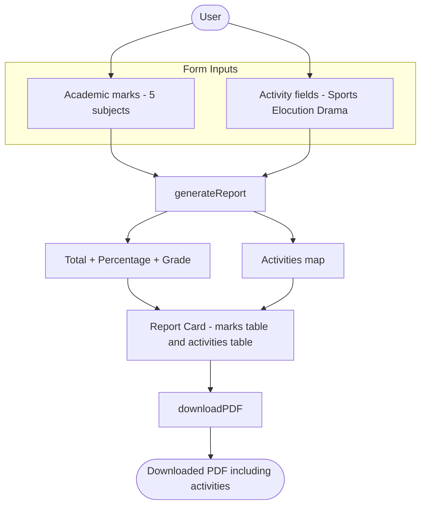
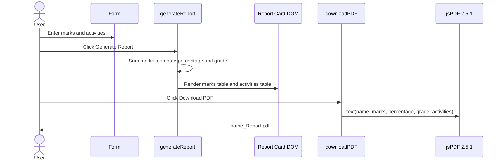

# Non-Academic / Co-Curricular Activities

> A focused feature guide for the **Student Report Generator**. It documents how the application records and reports **non-academic / co-curricular activities** — **Sports**, **Elocution**, and **Drama** — in addition to the existing academic report card.

This guide is derived entirely from the project's single source of truth, the root [`Readme.md`](../Readme.md), where the application's `index.html`, `style.css`, and `script.js` live as embedded code blocks. Every technical detail below carries an inline `Source: Readme.md:Lxx` citation so it can be traced back to that source.

---

## Overview

The Student Report Generator was originally a purely academic tool: a user enters student details and marks for five subjects, and the app calculates the total and percentage, assigns a grade, renders an on-screen report card, and exports it as a PDF (`Source: Readme.md:L4-L8`).

This feature extends that report so it **also** presents **non-academic / co-curricular activities** — **Sports**, **Elocution**, and **Drama** — alongside the existing academic results, both on screen and in the exported PDF. The activities are shown in their own clearly separated section so the academic summary stays first and unchanged (`Source: Readme.md:L9, L142`).

**Why this matters.** Recording co-curricular participation and achievement gives a fuller picture of a student than marks alone, while keeping that information visually and logically distinct from the academic score.

> **A note on terminology.** The original request asked for *"non acedemic activities such as sports, elucation, drama participation"*. The word **"elucation"** is interpreted throughout this project as **Elocution**. Authored prose below uses the correct spellings (academic, performance, Elocution); the original wording is preserved only in that direct quote.

For the academic baseline and the full embedded source, see the main project README: [Student Report Generator README](../Readme.md).

### Data Flow

The diagram below shows the end-to-end flow. Academic marks and the activity fields both feed `generateReport()`; the academic path produces the total, percentage, and grade, while the activities path is collected into a small map. Both are rendered into the report card, which `downloadPDF()` then exports — activities included.



---

## Data Model

The feature adds **three free-text inputs** — one each for Sports, Elocution, and Drama — which `generateReport()` collects into a small map and renders as a separate table (`Source: Readme.md:L86-L89`, `Source: Readme.md:L277-L302`). Conceptually, the non-academic / co-curricular activities are a plain key → value map:

```javascript
const activities = { Sports: sportsValue, Elocution: elocutionValue, Drama: dramaValue };
```

Each value is a **free-text participation/achievement descriptor** — a short phrase the user types, such as `Winner - District` or `Participated`. There is no fixed vocabulary, no numeric score, and no validation beyond what the browser applies to a text input; whatever the user types is what appears in the report and the PDF.

This deliberately mirrors the existing per-subject input pattern (one input per item) so the feature feels native to the form (`Source: Readme.md:L80-L89`).

### Optional future extension (not implemented)

A richer, **structured** model could represent each activity as a repeatable row with discrete fields — for example a **category**, a **level** (School / District / State / National), and a free-text **remark**:

```javascript
// OPTIONAL future variant — NOT the implemented model.
const activitiesStructured = [
  { category: 'Sports',    level: 'District', remark: 'Winner' },
  { category: 'Elocution', level: 'School',   remark: 'Participated' },
  { category: 'Drama',     level: 'School',   remark: 'Best Actor' }
];
```

This structured variant is documented **only** as a possible future enhancement. It is **not** the model the application implements today, and no entity diagram is provided for it. The implemented model is the simple free-text map shown above.

---

## UI Fields

The three new inputs sit inside the form's `.form-section`, **after** the five subject inputs and **before** the Generate Report / Download PDF buttons, so the form reads top-to-bottom as identity → academic marks → activities → actions (`Source: Readme.md:L76-L93`).

| Field | Input ID | Type | Placeholder | Example value |
| --- | --- | --- | --- | --- |
| Sports | `#sports` | text (free-text) | `Sports (e.g., Winner - District)` | `Winner - District` |
| Elocution | `#elocution` | text (free-text) | `Elocution (e.g., Participated)` | `Participated` |
| Drama | `#drama` | text (free-text) | `Drama (e.g., Best Actor - School)` | `Best Actor - School` |

The corresponding markup mirrors the existing text inputs on the form (`Source: Readme.md:L86-L89`):

```html
<input type="text" id="sports" placeholder="Sports (e.g., Winner - District)">
<input type="text" id="elocution" placeholder="Elocution (e.g., Participated)">
<input type="text" id="drama" placeholder="Drama (e.g., Best Actor - School)">
```

These inputs need **no new CSS**: the generic `input` selector and the `.form-section` grid already style and lay them out exactly like the subject fields (`Source: Readme.md:L169-L178`).

---

## Report Card Rendering

When the user clicks **Generate Report**, a new **Co-Curricular / Non-Academic Activities** section is rendered inside the report card, **after** the grade line, so the academic summary (subjects, total, percentage, grade) always comes first (`Source: Readme.md:L115-L124`). The section is a table that mirrors the existing marks table, with columns **Activity** and **Participation / Achievement**, and a table body identified as `#activitiesTable`:

```html
<h3>Co-Curricular / Non-Academic Activities</h3>
<table>
    <thead>
        <tr>
            <th>Activity</th>
            <th>Participation / Achievement</th>
        </tr>
    </thead>
    <tbody id="activitiesTable"></tbody>
</table>
```

Inside `generateReport()`, the three fields are collected into the `activities` map and rendered into `#activitiesTable` (`Source: Readme.md:L277-L302`). Because the activity values are **free-text**, each row is built with `document.createElement(...)` and its cell text is assigned via `textContent` rather than by interpolating the values into an HTML string, so the values are rendered literally and **never parsed as HTML** — which prevents script/markup injection in the report card (`Source: Readme.md:L286-L302`):

```javascript
const activities = {
    Sports: document.getElementById('sports').value,
    Elocution: document.getElementById('elocution').value,
    Drama: document.getElementById('drama').value
};

const activitiesBody = document.getElementById('activitiesTable');
activitiesBody.innerHTML = '';

for (let activity in activities) {
    // Activity values are free-text, so build each row with DOM APIs and
    // assign the text via textContent. The values are therefore rendered
    // as plain text and never parsed as HTML, preventing script/markup
    // injection in the report card.
    const row = document.createElement('tr');

    const activityCell = document.createElement('td');
    activityCell.textContent = activity;

    const valueCell = document.createElement('td');
    valueCell.textContent = activities[activity];

    row.appendChild(activityCell);
    row.appendChild(valueCell);
    activitiesBody.appendChild(row);
}
```

This collection and rendering is **purely additive**: the existing academic rendering — building the subjects map, summing the `total`, computing the `percentage`, and assigning the `grade` — is left exactly as it was (`Source: Readme.md:L223-L273`). The activities are written to their own table and never interfere with the academic output.

---

## PDF Output

When the user clicks **Download PDF**, `downloadPDF()` builds the document with **jsPDF 2.5.1** (pinned via its CDN URL) and writes the academic lines first: the title at `y = 20`, then Student Name, Roll Number, Total Marks, Percentage, and Grade on lines spaced 10 units apart, ending with the **grade line at `y = 80`** (`Source: Readme.md:L69`, `Source: Readme.md:L316-L324`).

The feature appends the activities **below the grade line**, continuing the same 10-unit vertical spacing at `y = 95, 105, 115, 125` (`Source: Readme.md:L333-L336`):

```javascript
const sports = document.getElementById('sports').value;
const elocution = document.getElementById('elocution').value;
const drama = document.getElementById('drama').value;

doc.text('Non-Academic / Co-Curricular Activities', 20, 95);
doc.text(`Sports: ${sports}`, 20, 105);
doc.text(`Elocution: ${elocution}`, 20, 115);
doc.text(`Drama: ${drama}`, 20, 125);
```

The exported PDF therefore lays these lines out at fixed vertical coordinates. The table below summarizes the boundary academic line (the grade line) and the appended activity lines:

| Line | Content | Y-coordinate | Source |
| --- | --- | --- | --- |
| Grade (last academic line) | `Grade: <grade>` | 80 | `Readme.md:L324` |
| Activities header | `Non-Academic / Co-Curricular Activities` | 95 | `Readme.md:L333` |
| Sports | `Sports: <value>` | 105 | `Readme.md:L334` |
| Elocution | `Elocution: <value>` | 115 | `Readme.md:L335` |
| Drama | `Drama: <value>` | 125 | `Readme.md:L336` |

Both `doc.text(...)` and `doc.save(...)` are provided by jsPDF **2.5.1** (`Source: Readme.md:L69`). Saving the file remains the **final action** of the function, unchanged by this feature (`Source: Readme.md:L338`):

```javascript
doc.save(`${name}_Report.pdf`);
```

### Sequence Diagram

The sequence below traces a full session: the user enters marks and activities, generates the report (which sums marks, computes the percentage and grade, and renders both tables), then downloads the PDF including the activities.



---

## Worked Example

Consider a student **Asha Verma**, **Roll Number 23**, with the following marks and activities.

**Academic marks**

| Subject | Marks |
| --- | --- |
| Maths | 95 |
| Science | 88 |
| English | 76 |
| History | 82 |
| Computer | 91 |

The five subjects sum to **total = 432**. The percentage is `percentage = (total / 500) * 100 = (432 / 500) * 100 = 86.40%`, which falls in the `>= 80` band, so the **grade = A** (`Source: Readme.md:L253`, `Source: Readme.md:L255-L267`).

**Activities entered**

- Sports → `Winner - District`
- Elocution → `Participated`
- Drama → `Best Actor - School`

These produce the following on-screen **Co-Curricular / Non-Academic Activities** table (`Source: Readme.md:L115-L124`):

| Activity | Participation / Achievement |
| --- | --- |
| Sports | Winner - District |
| Elocution | Participated |
| Drama | Best Actor - School |

And the following lines are appended to the exported PDF, immediately below the grade line (`Source: Readme.md:L333-L336`):

```text
Non-Academic / Co-Curricular Activities
Sports: Winner - District
Elocution: Participated
Drama: Best Actor - School
```

Crucially, the **total (432), percentage (86.40%), and grade (A) are computed only from the five subjects**. The non-academic / co-curricular activities appear in the report and the PDF but do **not** change any of those academic values (`Source: Readme.md:L253`, `Source: Readme.md:L255-L267`).

---

## Behavior Notes

**Activities are non-scoring.** This is the single most important behavioral rule of the feature. Recording Sports, Elocution, and Drama is **separate** from the academic calculation:

- The `activities` values are **never** added to `total` (`Source: Readme.md:L275-L281`).
- The percentage formula is unchanged: `percentage = (total / 500) * 100` (`Source: Readme.md:L253`).
- The six-tier grade ladder is unchanged — **A+ ≥ 90, A ≥ 80, B ≥ 70, C ≥ 60, D ≥ 50, else F** (`Source: Readme.md:L255-L267`):

| Percentage | Grade |
| --- | --- |
| ≥ 90 | A+ |
| ≥ 80 | A |
| ≥ 70 | B |
| ≥ 60 | C |
| ≥ 50 | D |
| otherwise | F |

The `÷ 500` divisor stays as-is because the score is still calculated over exactly the **five** academic subjects; adding activity fields does **not** change the divisor (`Source: Readme.md:L253`).

If a **scored** model is ever desired — where activities contribute points to the total or to a separate co-curricular score — it must be requested **explicitly**. The default, documented behavior is **non-scoring**: the non-academic / co-curricular activities are recorded and displayed only.

---

## Troubleshooting

- **Empty activity fields render as blank rows.** If a user leaves Sports, Elocution, or Drama empty, that activity still appears in the `#activitiesTable` (the **Activity** name is always shown) but its **Participation / Achievement** cell is empty, and the corresponding PDF line shows the label with no value (for example, `Sports:` with nothing after it). This is expected behavior, not a bug (`Source: Readme.md:L286-L302`, `Source: Readme.md:L333-L336`).

- **Long descriptors may wrap or overflow in the PDF.** The activity lines are drawn with `doc.text(...)` at fixed coordinates (`y = 105, 115, 125`), and this simple version does **not** auto-wrap text (`Source: Readme.md:L333-L336`). Very long descriptors can run past the page margin. Keep descriptors short (for example, `Winner - District`), or treat `doc.splitTextToSize(...)` as an optional future improvement for automatic wrapping.

- **The reference PDF becomes stale.** The repository includes `Student Report Generator Javascript Pdf.pdf`, a rendered duplicate of the README kept for reference only. Once this feature lands, that file no longer reflects the documented behavior and is flagged for **optional regeneration**; there is no automated step to rebuild it.

---

For the academic baseline, the embedded source, and the project structure, return to the main project README: [Student Report Generator README](../Readme.md).
